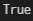
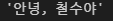
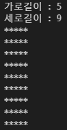
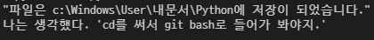

# 1. Python 예약어

```
['False', 'None', 'True', '__peg_parser__', 'and', 'as', 'assert', 'async', 'await', 'break', 'class', 'continue', 'def', 'del', 'elif', 'else', 'except', 'finally', 'for', 'from', 'global', 'if', 'import', 'in', 'is', 'lambda', 'nonlocal', 'not', 'or', 'pass', 'raise', 'return', 'try', 'while', 'with', 'yield']
```

# 2. 실수 비교

```
import math

num1 = 0.1 * 3
num2 = 0.3

print(math.isclose(num1, num2))
```



# 3. 이스케이프 시퀀스

```
(1) 줄 바꿈 : \n
(2) 탭 : \t
(3) 백슬래시 : \b
```

# 4. String Interpolation

```
name = '철수'

print('\'안녕, {}야\''.format(name))
```



# 5. 형 변환

```
int('3.5') # (5)
```


# 6. 네모 출력

```
n = int(input("가로길이 : "))
m = int(input("세로길이 : "))
box = ((('*'*n +'\n'))*(m-1) + ('*'*n))
print(box)
```



# 7. 이스케이프 시퀀스 응용

```
print('"파일은 c:\\Windows\\User\\내문서\\Python에 저장이 되었습니다."\n나는 생각했다. \'cd를 써서 git bash로 들어가 봐야지.\'')
```



# 8. 근의 공식

```
a = float(input("ax^2+bx+c 중 a를 입력하세요 : "))
b = float(input("ax^2+bx+c 중 b를 입력하세요 : "))
c = float(input("ax^2+bx+c 중 c를 입력하세요 : "))

quadratic_formula1_answer = (-b+(b**2-4*a*c)**(1/2))/(2*a)
quadratic_formula2_answer = (-b-(b**2-4*a*c)**(1/2))/(2*a)
```

