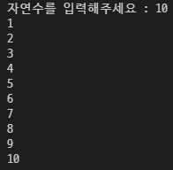
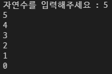
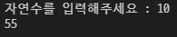

# 1. 세로로 출력하기

```
number = int(input('자연수를 입력해주세요 : '))

number = range(1, number+1)

count = 0

for count in number:
    print(count)
```

# 

# 2. 거꾸로 세로로 출력하기

```
number = int(input('자연수를 입력해주세요 : '))

number = range(number, -1, -1)

sum = 0

count = 0

for count in number:
    print(count)
```



# 3. N줄 덧셈

```
number = int(input('자연수를 입력해주세요 : '))

number = range(number+1)

sum = 0

count = 0

for count in number:
    sum = sum+count
    
else : print(sum)
```



