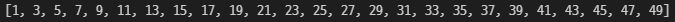
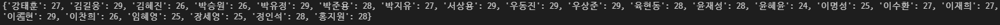
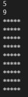
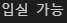
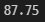

# 1. Mutable & Immutable

```
Mutable : List, Set, Dictionary
Immutable : String, Tuple, Range
```

# 2. 홀수만 담기

```
a = list(range(51))
a = a[1::2]
print(a)
```



# 3. Dictionary 만들기

```
students_name_age = {'강태훈' : 27, '김길웅' : 29, '김혜진' : 26, '박승원' : 26,
            '박유정' : 29, '박준용' : 28, '박지유' : 27, '서상용' : 29,
            '우동진' : 29, '우상준' : 29, '육현동' : 28, '윤재성' : 28,
            '윤혜윤' : 24, '이명성' : 25, '이수환' : 27, '이재희' : 27,
            '이종현' : 29, '이찬희' : 26, '임혜영' : 25, '장세영' : 25,
            '정인석' : 28, '홍지원' : 28}
print(students_name_age)
```



# 4. 반복문으로 네모 출력

```
n = int(input())
m = int(input())

width = '*'*n

length = 0

while length < m :
    length += 1
    print(width)
```



# 5. 조건 표현식

```
temp = 36.5
print('입실 불가') if temp >= 37.5 else print('입실 가능')
```



# 6. 평균 구하기

```
scores = [80, 89, 99, 83]
sum_score = 0

for i in scores :
    sum_score += i

print(sum_score/4)
```



