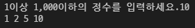
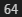
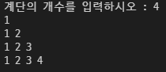

# 1. 간단한 N의 약수

```
N = int(input('1이상 1,000이하의 정수를 입력하세요.'))

measure = 1
measure_list = []


while measure <= N :
    if N % measure == 0 :
            measure_list.append(measure)
    measure += 1

print(*measure_list)
```



# 2. 중간값 찾기

```
numbers = [
    85, 72, 38, 80, 69, 65, 68, 96, 22, 49, 67,
    51, 61, 63, 57, 66, 24, 80, 83, 71, 60, 64,
    52, 90, 60, 49, 31, 23, 99, 94, 11, 25, 24
]

numbers = sorted(numbers)

count = 0

for number in numbers :
    count = count + 1

if count % 2 :
    div = int((count+1)/2)
    median = numbers[div]
else :
    div1 = int(count/2)
    div2 = int((count-1)/2)
    median = (numbers[div1] + numbers[div2])/2

print(median)
```



# 3. 계단 만들기

```
stair = int(input('계단의 개수를 입력하시오 : '))

i =1

stair_count = []

while i <= stair :
    stair_count.append(i)
    print(*stair_count)
    i += 1
```



