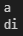
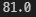

# 1. Built-in 함수

```
print(), range(), divmod(), input(), len()
```


# 2. 정중앙 문자

```
def get_middle_char(words) :
    length = len(words)
    if length % 2 :
        length //= 2
        words = list(words)
        word = words[length]
        print(words[length])
    else :
        length1 = (length // 2) - 1
        length2 = length // 2
        print(f'{words[length1]}{words[length2]}')

get_middle_char('nnafy')
get_middle_char('coding')
```



# 3. 위치 인자와 키워드 인자

```
# 4 nnafy(name='길동', '구미') <- 2개의 argument가 들어가서 오류발생
```


# 4. 나의 반환값은

```
None <- print의 반환값은 None이다.
```


# 5. 가변 인자 리스트

```
def my_avg(*numbers) :
    numbers_sum = sum(numbers)
    count = len(numbers)
    avg = numbers_sum/count
    print(avg)

my_avg(77, 83, 95, 80, 70)
```


