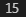
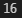
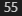

# 1. List의 합 구하기

```
def list_sum(numbers) :
    numbers = set(numbers)
    numbers_sum = 0
    for number in numbers :
        numbers_sum = numbers_sum + number
    print(numbers_sum)
    return numbers_sum

list_sum([1, 2, 3, 4, 5])
```



# 2. Dictionary로 이루어진 List의 합 구하기

```
def dict_list_sum(members) :
    members_age_sum = 0
    for member in members :
        members_age_sum += member['age']
    print(members_age_sum)
    return members_age_sum

dict_list_sum([{'name': 'kim', 'age': 12}, {'name': 'lee', 'age': 4}])
```



# 3. 2차원 List의 전체 합 구하기

```
def all_list_sum(number_list) :
    num_sum = 0
    for numbers in number_list :
        for number in numbers :
            num_sum += number
    print(num_sum)
    return num_sum

all_list_sum([[1], [2, 3], [4, 5, 6], [7, 8, 9, 10]])
```



