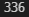
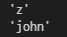

# 1. 숫자의 의미

```
def get_secret_word(numbers) :
    word = ''
    for number in numbers :
        word += chr(number)
    print(word)
    return word


get_secret_word([87, 79, 82, 75])
```

# 2. 내 이름은 몇일까?

```
def get_secret_number(words) : 
    words = list(words)
    word = 0
    for num in words :
        word += ord(num)
    print(word)
    return word

get_secret_number('tom')
```



# 3. 강한 이름

```
def get_strong_word(word1, word2) :
    words_list1 = list(word1)
    words_list2 = list(word2)
    word_num1 = 0
    word_num2 = 0
    for num in words_list1 :
        word_num1 += ord(num)
    for num in words_list2 :
        word_num2 += ord(num)

    if word_num1 > word_num2 :
        print(f'\'{word1}\'')
        return word1
    else :
        print(f'\'{word2}\'')
        return word2    

get_strong_word('z', 'a')
get_strong_word('tom', 'john')
```



