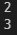
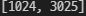

# 1. 모음은 몇 개나 있을까?

```
def count_vowels(words) :
    count = 0

    # 모음(aeiou)일 때, count를 1 더해서 개수 세기
    for word in words :
        if word == 'a' or word == 'e' or word == 'i' or word == 'o' or word == 'u' :
            count += 1
    print(count)
    return count

count_vowels('apple')
count_vowels('banana')
```



# 2. 문자열 조작

```
(4) .strip([chars])은 특정 문자를 지정하면, 양쪽에서 해당 문자를 찾아 제거한다. 특정 문자를 지정하지 않으면 오류가 발생한다. - (X) => 특정 문자를 지정하지 않으면 공백을 제거한다.
```


# 3. 정사각형만 만들기

```
def only_square_area(widths, heights) : 
    same_length_area = []
    # 너비와 높이가 같을 때 same_length_area에 넓이값 리스트로 넣기
    for width in widths :
        for height in heights :
            if width == height :
                same_length_area.append(height**2)
    
    print(same_length_area)
    return same_length_area

only_square_area([32, 55, 63], [13, 32, 40, 55])
```



