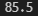
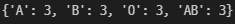

# 1. 평균 점수 구하기

```
def get_dict_avg(dict) :
    scores_sum = 0
    # 딕셔너리 값을 리스트로 변환하기
    scores = list(dict.values())
    # values 값들을 더하기
    for score in scores :
        scores_sum += score
    # 더한 값을 점수 개수만큼 나누기(평균값 계산)
    avg = scores_sum/len(scores)
    
    print(avg)
    return avg

get_dict_avg({
	'python': 80,
	'algorithm': 90,
    'django': 89,
    'web': 83,
})
```



# 2. 혈액형 분류하기

```
def count_blood(blood_list) :
    A_count = 0
    B_count = 0
    O_count = 0
    AB_count = 0
    
    # 혈액형 타입의 개수 측정
    for blood_type in blood_list :
        if blood_type == 'A' :
            A_count += 1
        elif blood_type == 'B' :
            B_count += 1
        elif blood_type == 'O' :
            O_count += 1
        else :
            AB_count += 1

    # 측정한 개수에 따라 딕셔너리 입력
    blood_dict = {'A' : A_count, 'B' : B_count, 'O' : O_count, 'AB' : AB_count}

    print(blood_dict)
    return blood_dict

count_blood([
    'A', 'B', 'A', 'O', 'AB', 'AB',
    'O', 'A', 'B', 'O', 'B', 'AB',
])
```



