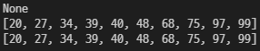
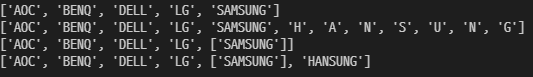
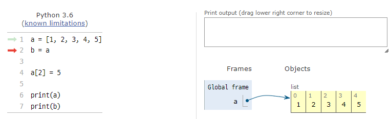
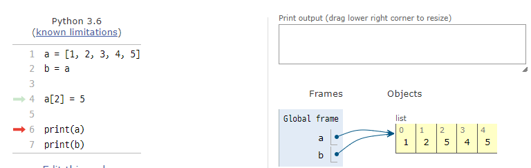
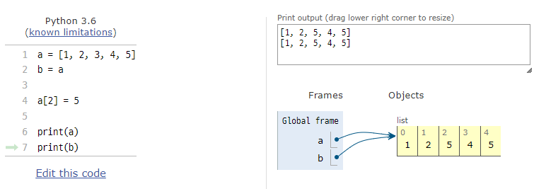

# 1. Built-in 함수와 메서드

```
sorted() : 정렬하는 함수 (기존 함수의 값을 변형시키고 None을 리턴함)
.sort() : 정렬하는 함수 (원본을 변형시키지 않고 변형된 값을 리턴함)
```

```
import random

# 랜덤으로 0~99까지 숫자 중 10개 출력
random_number1 = random.sample(range(100), 10)
random_number2 = list(random_number1)

#sort()에 반환되는 값 출력
print(random_number1.sort())
#sort()로 인해 정렬된 값 출력
print(random_number1)
#sorted()로 인해 정렬된 값 출력
print(sorted(random_number2))
```




# 2. .extend()와 .append()

```
.extend() : 리스트에 iterable값을 붙일 수 있다. 만약 문자열로 넣는다면 문자 개별로 붙이게 되고, 
대괄호를 써서 넣는다면 문자열을 유지하고 붙일 수 있다.
.append() : 리스트에 값을 추가할 수 있다.
```

```
monitor_producting_company = ['AOC', 'BENQ', 'DELL', 'LG']
monitor_producting_company2 = list(monitor_producting_company)

monitor_producting_company.extend(['SAMSUNG'])
print(monitor_producting_company)
monitor_producting_company.extend('HANSUNG')
print(monitor_producting_company)

monitor_producting_company2.append(['SAMSUNG'])
print(monitor_producting_company2)
monitor_producting_company2.append('HANSUNG')
print(monitor_producting_company2)
```



# 3. 복사가 잘 된 건가?

```
 pythonutuor 홈페이지에서 스크린샷을 찍어왔다. <그림 3 - 1>과 같이 a 리스트를 정의하면 한 a의 주소가 지정된다. 
 그 후 b = a를 한다면 a리스트와 b리스트가 한 주소의 데이터를 공유하게 된다. 
 이로 인해 4번째 줄에서 a[2]를 5로 변경했을 때 <그림 3 - 2>와 같이 주어진 주소의 데이터가 변경되어 b[2]의 값도 5로 변경되고, 결국 <그림 3 - 3>에서 보이듯이 print의 출력이 같게 나온다.
```




​																															<그림 3 - 1>



​																															<그림 3 - 2>




​																															<그림 3 - 3>
