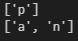
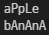
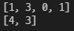

# 1. 무엇이 중복일까

```
def duplicated_letters(words) :
    count_words = {}
    a_lot_words = []

    # 주어진 문자열에서 각 문자의 갯수 측정
    for word in words :
        if word not in count_words :
            count_words[word] = 1
        else :
            count_words[word] +=1 

    # 문자 얻어오기
    alpha = list(count_words.keys())
    # 각 문자의 개수 얻어오기
    num = list(count_words.values())

    # 문자가 2개 이상인 경우 a_lot_words 리스트에 넣음
    for i in range(len(alpha)) :
        if num[i] > 1 :
            a_lot_words.append(alpha[i])

    print(a_lot_words)

duplicated_letters('apple')
duplicated_letters('banana')
```



# 2. 소대소대

```
def low_and_up(words) :
    new_words_list = ''
    change_word = ''

    # 문자열 길이만큼 반복
    for i in range(len(words)) :
        # 문자 인덱스가 홀수일 때 대문자로 변환
        if i % 2 :
            word = words[i]
            new_words_list += word.upper()
        # 문자 인덱스가 0 또는 짝수일 때 소문자로 변환
        else : 
            word = words[i]
            new_words_list += word.lower()
    
    print(new_words_list)


low_and_up('apple')
low_and_up('banana')
```



# 3. 숫자의 의미

```
def lonely(num_list) :
    new_num_list = []

    # 문자열 길이만큼 반복
    for i in range(len(num_list)) :
        # 첫 문자는 확정으로 넣기
        if i == 0 :
            new_num_list.append(num_list[i])
        else :
            # 전 문자와 현 문자가 같을 경우 pass
            if num_list[i-1] == num_list[i] :
                pass
            # 전 문자와 현 문자가 다를 경우 리스트에 추가
            else :                 
                new_num_list.append(num_list[i])
    
    print(new_num_list)

lonely([1, 1, 3, 3, 0, 1, 1])
lonely([4, 4, 4, 3, 3])
```


