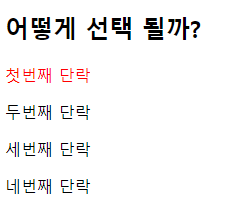
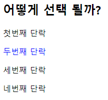

# 1. img tag

```
<!DOCTYPE html>
<html lang="en">
<head>
  <meta charset="UTF-8">
  <meta http-equiv="X-UA-Compatible" content="IE=edge">
  <meta name="viewport" content="width=device-width, initial-scale=1.0">
  <title>Document</title>
</head>
<body>
  <!-- 이미지가 있는 절대주소 -->
  
</body>
</html>
```


# 2. 파일 경로

```
(a) = 절대주소
(b) = 상대주소
```

```
<!DOCTYPE html>
<html lang="en">
<head>
  <meta charset="UTF-8">
  <meta http-equiv="X-UA-Compatible" content="IE=edge">
  <meta name="viewport" content="width=device-width, initial-scale=1.0">
  <title>Document</title>
</head>
<body>
  <!-- 이미지가 있는 상대주소 -->
  
</body>
</html>
```


# 3. Hyper Link

```
<!DOCTYPE html>
<html lang="en">
<head>
  <meta charset="UTF-8">
  <meta http-equiv="X-UA-Compatible" content="IE=edge">
  <meta name="viewport" content="width=device-width, initial-scale=1.0">
  <title>Document</title>
</head>
<body>
  <!-- 이미지가 있는 상대주소 -->
  <a href="http://google.com"></a>
</body>
</html>
```


# 4. 선택자

```
<!DOCTYPE html>
<html lang="en">
<head>
  <meta charset="UTF-8">
  <meta http-equiv="X-UA-Compatible" content="IE=edge">
  <meta name="viewport" content="width=device-width, initial-scale=1.0">
  <title>Document</title>
</head>
<body>
  <div id="carry">
    <h2>어떻게 선택 될까?</h2>
      <p>첫번째 단락</p>
      <p>두번째 단락</p>
      <p>세번째 단락</p>
      <p>네번째 단락</p>
  </div>
  <style>
  #carry > p:nth-child(2) {
    color: red;
  }
  </style>
</body>
</html>
```



```
<!DOCTYPE html>
<html lang="en">
<head>
  <meta charset="UTF-8">
  <meta http-equiv="X-UA-Compatible" content="IE=edge">
  <meta name="viewport" content="width=device-width, initial-scale=1.0">
  <title>Document</title>
</head>
<body>
  <div id="carry">
    <h2>어떻게 선택 될까?</h2>
      <p>첫번째 단락</p>
      <p>두번째 단락</p>
      <p>세번째 단락</p>
      <p>네번째 단락</p>
  </div>
  <style>
  #carry > p:nth-of-type(2) {
    color: blue;
  }
  </style>
</body>
</html>
```



```
:nth-child(2)의 경우 carry(부모)안에 모든 요소 중 2번째라 첫번째 단락이 출력됐고(1번째는 어떻게 선택 될까?), :nth-of-type(2)는 carry(부모)안에 p라는 요소 중 2번째라 두번째 단락이 출력됐다.
```

