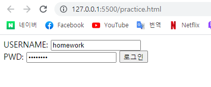

# 1. Semantic Tag

```
새롭게 추가된 시맨틱 태그 : header, section, footer
```


# 2. input Tag

```
<!DOCTYPE html>
<html lang="en">
<head>
  <meta charset="UTF-8">
  <meta http-equiv="X-UA-Compatible" content="IE=edge">
  <meta name="viewport" content="width=device-width, initial-scale=1.0">
  <title>Document</title>
</head>
<body>
  <form action="">
    <!-- 아이디 입력 -->
    <label for="name">USERNAME:</label>
    <input type="text" id="name" name="name" placeholder="아이디를 입력 해 주세요." ><br>
    <label for="PWD">PWD:</label>
    <!-- 비밀번호 입력 -->
    <input type="password" id="PWD" PWD="PWD" placeholder="비밀번호를 입력해 주세요.">
    <input type="submit" value="로그인">
  </form>
</body>
</html>
```



# 3. 크기 단위

```
HTML 최상위 요소의 사이즈를 기준으로 삼는 크기 단위 : rem
```


# 4. 선택자

```
/* 자손 결합자 */
/* div p 자손 결합자는 div 하위의 모든 p 요소를 선택한다. */
div p {
	color: crimson;
}

/* 자식 결합자 */
/* div > p 자식 결합자는 div 하위의 바로 아래의 p 요소를 선택한다. */
div > p {
	color: crimson;
}
```

