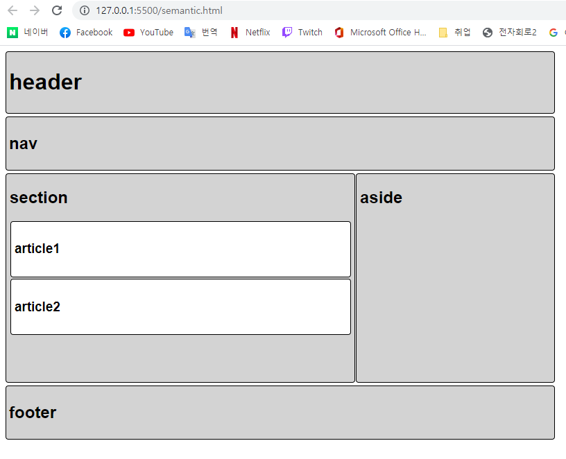

# 1. Semancit Tag

```
<!DOCTYPE html>
<html lang="ko">
<head>
  <meta charset="UTF-8">
  <meta name="viewport" content="width=device-width, initial-scale=1.0">
  <link rel="stylesheet" href="semantic.css">
  <title>Layout Practice</title>
</head>
<body>
  <header class="header">
    <h1>header</h1>
  </header>
  <nav class="nav">
    <h2>nav</h2>
  </nav>
  <div class="clearfix">
    <section class="section">
      <h2>section</h2>
      <article class="article1">
        <h3>article1</h3>
      </article>
      <article class="article2">
        <h3>article2</h3>
      </article>
    </section>
    <aside class="aside">
      <h2>aside</h2>
    </aside>
  </div>  
  <footer class="footer">
    <h2>footer</h2>
  </footer>
</body>
</html>
```

```
/* 아래 코드는 수정하지 마세요. */
body {
  font-family: Arial;
  width: 800px;
}

section {
  float: left;
  margin-left: 4px;
}

aside { 
  float: right;
  margin-right: 4px;
}

.clearfix::after {
  content: "";
  display: block;
  clear: both;
}

/* 여기서부터 작성하세요. */
/* 모든 스타일 요소를 ***클래스***로 만들어 작성 후 사용합니다. */

/* 1. article 태그는 white로 나머지 시멘틱 태그는 lightgrey로 배경색을 바꿔주세요. */
.article1,
.article2 {
  background-color: white;
}

.header,
.nav,
.section,
.aside,
.footer {
  background-color: lightgrey;
}

/* 2. header, nav, footer 태그의 margin을 4px로 만들어주세요. */

.header,
.nav,
.footer {
  margin: 4px;
}

/* 3. header, nav, footer 태그의 padding을 4px로 만들어주세요. */

.header,
.nav,
.footer {
  padding: 4px;
}

/* 4. h1 태그를 수평 중앙 정렬 시켜주세요. */

/* 5. section 태그는 width 490px height 300px, 
   aside 태그는 width 280px height 300px로 만들어주세요.*/

.section {
  width: 490px;
  height: 300px;
}

.aside {
  width: 280px;
  height: 300px;
}

/* 6. 모든 semantic 태그의 border 두께를 1px, 실선, 검은색으로 만들어주세요. */

.header,
.nav,
.section,
.article1,
.article2,
.aside,
.footer {
  border: 1px solid black;
}

/* 7. 모든 semantic 태그의 border 모서리 반경을 4px로 만들어주세요. */

.header,
.nav,
.section,
.article1,
.article2,
.aside,
.footer {
  border-radius: 4px;
}

/*맞지 않는 부분 수정*/

/* article1, 2의 간격 띄우고 크기 조절 */
.article1,
.article2 {  
  box-sizing: border-box;
  padding: 10px 5px 10px 5px;
  margin: 0 5px 0 1px;
}

/* article1과 2의 거리 벌리기 */
.article2 {
  position: relative;
  top: 2px;
}

/* section 문자의 앞 간격 조금 띄우기 */
.section {
  padding-left: 5px;
  width: 497px;
}

/* aside 문자의 앞 간격 조금 띄우기 */
.aside {
  padding-left: 5px;
}
```


