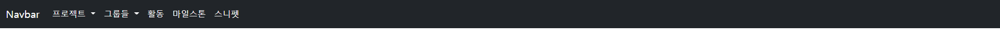
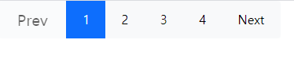

# 1. Components

```
Buttons에서 Button tags의 submit 타입을 사용
```

```
<!DOCTYPE html>
<html lang="en">
<head>
  <meta charset="UTF-8">
  <meta http-equiv="X-UA-Compatible" content="IE=edge">
  <meta name="viewport" content="width=device-width, initial-scale=1.0">
  <title>Document</title>

  <link href="https://cdn.jsdelivr.net/npm/bootstrap@5.0.2/dist/css/bootstrap.min.css" rel="stylesheet" integrity="sha384-EVSTQN3/azprG1Anm3QDgpJLIm9Nao0Yz1ztcQTwFspd3yD65VohhpuuCOmLASjC" crossorigin="anonymous">

</head>
<body>
  <div class="p-2 bg-white border-0 w-25 mx-auto">
    <input class="btn btn-success w-100 p-2" type="submit" value="Sign in">
  </div>
  <script src="https://cdn.jsdelivr.net/npm/bootstrap@5.0.2/dist/js/bootstrap.bundle.min.js" integrity="sha384-MrcW6ZMFYlzcLA8Nl+NtUVF0sA7MsXsP1UyJoMp4YLEuNSfAP+JcXn/tWtIaxVXM" crossorigin="anonymous"></script>
</body>
</html>
```


# 2. Components

```
Navbar에서 Supported content를 사용
```

```
<!DOCTYPE html>
<html lang="en">
<head>
  <meta charset="UTF-8">
  <meta http-equiv="X-UA-Compatible" content="IE=edge">
  <meta name="viewport" content="width=device-width, initial-scale=1.0">
  <title>Document</title>

  <link href="https://cdn.jsdelivr.net/npm/bootstrap@5.0.2/dist/css/bootstrap.min.css" rel="stylesheet" integrity="sha384-EVSTQN3/azprG1Anm3QDgpJLIm9Nao0Yz1ztcQTwFspd3yD65VohhpuuCOmLASjC" crossorigin="anonymous">

</head>
<body>
  <nav class="navbar navbar-expand-lg navbar-dark bg-dark">
    <div class="container-fluid">
      <a class="navbar-brand" href="#">Navbar</a>
      <button class="navbar-toggler" type="button" data-bs-toggle="collapse" data-bs-target="#navbarSupportedContent" aria-controls="navbarSupportedContent" aria-expanded="false" aria-label="Toggle navigation">
        <span class="navbar-toggler-icon"></span>
      </button>
      <div class="collapse navbar-collapse" id="navbarSupportedContent">
        <ul class="navbar-nav me-auto mb-2 mb-lg-0">
          <li class="nav-item dropdown">
            <a class="nav-link dropdown-toggle active" href="#" id="navbarDropdown" role="button" data-bs-toggle="dropdown" aria-expanded="false">
              프로젝트
            </a>
          </li>
          <li class="nav-item dropdown">
            <a class="nav-link dropdown-toggle active" href="#" id="navbarDropdown" role="button" data-bs-toggle="dropdown" aria-expanded="false">
              그룹들
            </a>
          </li>
          <li class="nav-item">
            <a class="nav-link active" aria-current="page" href="#">활동</a>
          </li>
          <li class="nav-item">
            <a class="nav-link active" aria-current="page" href="#">마일스톤</a>
          </li>
          <li class="nav-item">
            <a class="nav-link active" aria-current="page" href="#">스니펫</a>
          </li>
        </ul>
      </div>
    </div>
  </nav>
  <script src="https://cdn.jsdelivr.net/npm/bootstrap@5.0.2/dist/js/bootstrap.bundle.min.js" integrity="sha384-MrcW6ZMFYlzcLA8Nl+NtUVF0sA7MsXsP1UyJoMp4YLEuNSfAP+JcXn/tWtIaxVXM" crossorigin="anonymous"></script>
</body>
</html>
```



# 3. Components

```
Button gropu의 Button toolbar사용하고 prev는 Button의 disabled도 사용
```

```
<!DOCTYPE html>
<html lang="en">
<head>
  <meta charset="UTF-8">
  <meta http-equiv="X-UA-Compatible" content="IE=edge">
  <meta name="viewport" content="width=device-width, initial-scale=1.0">
  <title>Document</title>

  <link href="https://cdn.jsdelivr.net/npm/bootstrap@5.0.2/dist/css/bootstrap.min.css" rel="stylesheet" integrity="sha384-EVSTQN3/azprG1Anm3QDgpJLIm9Nao0Yz1ztcQTwFspd3yD65VohhpuuCOmLASjC" crossorigin="anonymous">

</head>
<body>
  <div class="btn-toolbar w-25 mx-auto" role="toolbar" aria-label="Toolbar with button groups">
    <div class="btn-group me-2 w-75" role="group" aria-label="First group">
      <button type="button" class="btn btn-light btn-lg" disabled>Prev</button>
      <button type="button" class="btn btn-primary">1</button>
      <button type="button" class="btn btn-light">2</button>
      <button type="button" class="btn btn-light">3</button>
      <button type="button" class="btn btn-light">4</button>
      <button type="button" class="btn btn-light">Next</button>
    </div>
  </div>
  <script src="https://cdn.jsdelivr.net/npm/bootstrap@5.0.2/dist/js/bootstrap.bundle.min.js" integrity="sha384-MrcW6ZMFYlzcLA8Nl+NtUVF0sA7MsXsP1UyJoMp4YLEuNSfAP+JcXn/tWtIaxVXM" crossorigin="anonymous"></script>
</body>
</html>
```



# 4. Login Page

```
기본적으로 다 border에 넣고 시작
처음 부분은 alert, 두 번째 부분은 text입력, Sign in은 이중박스에 넣어 상위박스는 bottom을 없애고 하위박스는 밑 색을 primary로 지정
이메일 패스워드는 Forms의 Overview를 사용
Remember me는 Forms의 Checks, Forgot your password?는 Text decoration 사용
sign up은 Buttons에서 Button tags의 submit 타입을 사용
```

```
<!DOCTYPE html>
<html lang="en">
<head>
  <meta charset="UTF-8">
  <meta http-equiv="X-UA-Compatible" content="IE=edge">
  <meta name="viewport" content="width=device-width, initial-scale=1.0">
  <title>Document</title>

  <link href="https://cdn.jsdelivr.net/npm/bootstrap@5.0.2/dist/css/bootstrap.min.css" rel="stylesheet" integrity="sha384-EVSTQN3/azprG1Anm3QDgpJLIm9Nao0Yz1ztcQTwFspd3yD65VohhpuuCOmLASjC" crossorigin="anonymous">

</head>
<body>
  <div class="p-2 bg-white border-0 w-25 mx-auto">
    <div class="alert alert-danger p-3" role="alert">
      &nbsp&nbsp&nbsp&nbsp Invalid Login or password.
    </div>
    <p class="fs-2 fw-bold">GitLab</p>
    <div class="p-2 bg-white border border-bottom-0 p-3">
      <div class="border-bottom border-primary p-2 fs-6 fw-bold" style="text-align: center;">Sign in</div>
    </div>
    <div class="p-2 bg-white border border-top-0 p-3">
        <div class="mb-3">
          <label for="exampleInputEmail1" class="form-label fw-bold">Username or email</label>
          <input type="email" class="form-control" id="exampleInputEmail1" aria-describedby="emailHelp">
          <div id="emailHelp" class="form-text">We'll never share your email with anyone else.</div>
        </div>
        <div class="mb-3">
          <label for="exampleInputPassword1" class="form-label fw-bold">Password</label>
          <input type="password" class="form-control" id="exampleInputPassword1">
        </div>
        <div class="mb-3 form-check">
          <input type="checkbox" class="form-check-input" id="exampleCheck1">
          <label class="form-check-label">Remember me</label>
          <a class="text-decoration-none float-end">Forgot your password?</a>
        </div>
        <button type="submit" class="btn btn-success w-100 p-2">Sign in</button>
    </div>
  </div>
  <script src="https://cdn.jsdelivr.net/npm/bootstrap@5.0.2/dist/js/bootstrap.bundle.min.js" integrity="sha384-MrcW6ZMFYlzcLA8Nl+NtUVF0sA7MsXsP1UyJoMp4YLEuNSfAP+JcXn/tWtIaxVXM" crossorigin="anonymous"></script>
</body>
</html>
```
