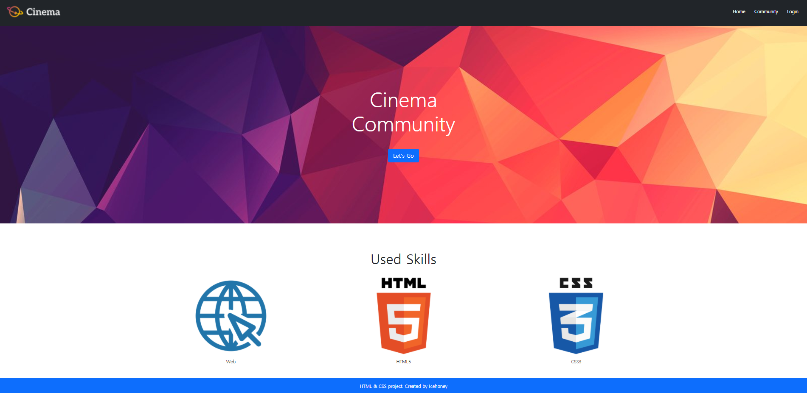

# Bootstrap Component

```
<!DOCTYPE html>
<html lang="ko">
<head>
  <meta charset="UTF-8">
  <meta name="viewport" content="width=device-width, initial-scale=1.0">
  <link rel="stylesheet" href="style.css">
  <title>Document</title>

  <link href="https://cdn.jsdelivr.net/npm/bootstrap@5.0.2/dist/css/bootstrap.min.css" rel="stylesheet" integrity="sha384-EVSTQN3/azprG1Anm3QDgpJLIm9Nao0Yz1ztcQTwFspd3yD65VohhpuuCOmLASjC" crossorigin="anonymous">
</head>
<body>
  <!-- 1. Nav -->
  <!-- Navbar 사용하고 sticky-top으로 위에 고정, 메뉴를 오른쪽으로 배열하기 위해 flex로 한 후 between사용, 그리고 중앙 라인 위치를 위해 align 사용 -->
  <nav class="sticky-top bg-dark d-flex justify-content-between align-items-center px-3">
    <a href="#">
            
    </a>
    <ul class="d-flex list-unstyled m-0">
      <!-- px-3 => 1rem씩 띄움 => 두개 사이는 2rem => spacing의 notaion에 적혀있음 -->
      <li class="px-3"><a href="#" class="text-decoration-none text-white">Home</a></li>
      <li class="px-3"><a href="#" class="text-decoration-none text-white">Community</a></li>
      <li class="px-3"><a href="#" class="text-decoration-none text-white">Login</a></li>
    </ul>
  </nav>
  
  <!-- 2. Header -->
  <!-- 그림 내에서 글 위치 시키고 흰색, 굵기 지정 -->
  <header class="d-flex flex-column justify-content-center align-items-center text-white fw-bold">
      <div class="display-2">Cinema</div>
      <div class="display-2">Community</div>
      <!-- 하이퍼링크 있는 버튼으로 만들기 -->
      <a href="#" class="btn btn-primary btn-lg mt-5">Let's Go</a>
  </header>

  <!-- 3. Section -->
  <!-- 그림을 flex내에 가로로 배열을 맞추고 중앙에 맞추기 -->
  <section class="d-flex flex-column align-items-center mt-5 pt-5">
    <h2 class="pb-3">Used Skills</h2>
    <!-- evenly사용으로 간격 띄우기 -->
    <article class="d-flex w-75 justify-content-evenly">
      <div>
        
        <p class="text-center">Web</p>
      </div>
      <div>
        
        <p class="text-center">HTML5</p>
      </div>
      <div>
        
        <p class="text-center">CSS3</p>
      </div>
    </article>
  </section>

  <!-- 4. Footer -->
  <!-- 파란색 박스 만들어 텍스트 입력 후 밑에 고정 -->
  <footer class="fixed-bottom bg-primary d-flex justify-content-center align-items-center">
    <p class="m-0 text-white">HTML & CSS project. Created by Icehoney</p>
  </footer>

  <script src="https://cdn.jsdelivr.net/npm/bootstrap@5.0.2/dist/js/bootstrap.bundle.min.js" integrity="sha384-MrcW6ZMFYlzcLA8Nl+NtUVF0sA7MsXsP1UyJoMp4YLEuNSfAP+JcXn/tWtIaxVXM" crossorigin="anonymous"></script>
  
</body>
</html>
```



