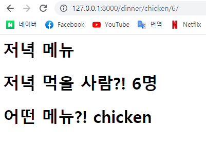

# Django Project

1. intro/urls.py

   ```
   from django.urls import path
   from articles import views
   
   urlpatterns = [
       path('dinner/<저녁메뉴>/<인원수>/',views.dinner),
   ]
   ```

2. pages/views.py

   ```
   from django.shortcuts import render
   
   def dinner(request, 저녁메뉴, 인원수):
       context = {
           'dinner_menu': 저녁메뉴,
           'people_count': 인원수,
       }
       return render(request, 'dinner.html', context)
   ```

3. templates/dinner.html

   ```
   <h1>저녁 메뉴</h1>
   <h1>저녁 먹을 사람?! {{ people_count }}명</h1>
   <h1>어떤 메뉴?! {{ dinner_menu }}
   ```

   

