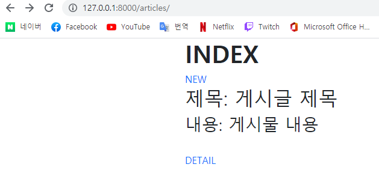
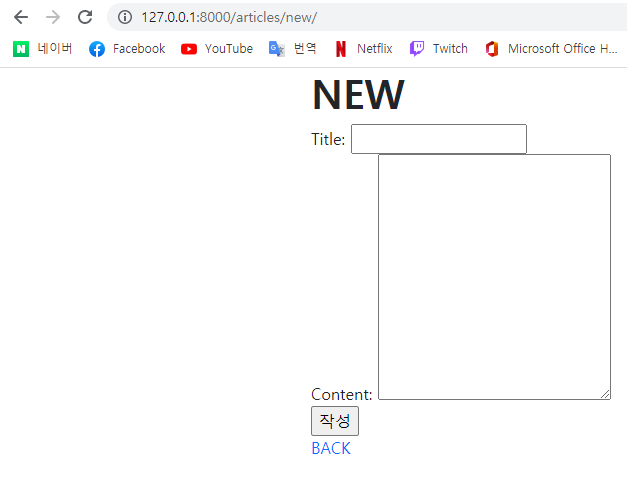
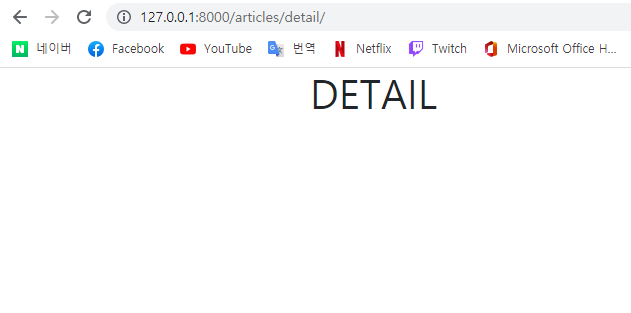

# Article CR

```
1. urls.py

from django.urls import path
from . import views


app_name = 'articles'
urlpatterns = [
    path('', views.index, name='index'),
    path('new/', views.new, name='new'),
    path('detail/', views.detail, name='detail'),
]
```

```
2. views.py

from django.shortcuts import render
from .models import Article

def index(request):
    articles = Article.objects.all()
    context = {
        'articles': articles,
    }
    return render(request, 'articles/index.html', context)


def new(request):
    return render(request, 'articles/new.html')
    
    
def detail(request):        
    return render(request, 'articles/detail.html')
```

```
3. html
 1) index.html
 


  <h1 class="fw-bold">INDEX</h1>
  <a href="", class="text-decoration-none">NEW</a>
  <br>

  <h2>제목: 게시글 제목</h2>
  <h3>내용: 게시물 내용</h3>
  <br>

  <a href="", class="text-decoration-none">DETAIL</a>


 2) new.html
 


  <h1 class="fw-bold">NEW</h1>
  <form action="" method="POST">
    
    <label for="title">Title: </label>
    <input type="text" id="title" name="title">
    <br>
    <label for="content">Content: </label>
    <textarea name="content" id="content" cols="30" rows="10"></textarea>
    <br>
    <input type="submit", value="작성">
  </form>
  <a href="", class="text-decoration-none">BACK</a>  


 3) detail.html
 


  <h1>DETAIL</h1>


```

```
4. models.py

from django.db import models

class Article(models.Model):
    title = models.CharField(max_length=10)
    content = models.TextField()
    created_at = models.DateTimeField(auto_now_add=True)
    updated_at = models.DateTimeField(auto_now=True)

    def __str__(self):
        return self.title
```







