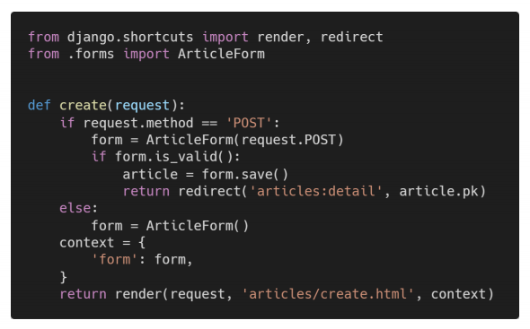

# 1. Form

```
아래 작성된 views.py의 코드 일부를 보고 문제에 알맞은 답을 서술하시오.
```



```
1. 왜 변수 context는 if else 구문과 동일한 레벨에 작성 되어있는가?
2. 왜 request의 http method는 POST 먼저 확인하도록 작성하는가?
```

```
1) if form.is_valid():에서 유효성을 검사했을 때 값이 0이 나왔을 경우를 대비하여 context를 else 안이 아닌 바깥으로 뺐다.
2) GET을 먼저 분기한다면 else에서 POST 이외의 다른 메소드에서도 동작하기 때문에 이를 방지하기 위해 POST를 먼저 확인하도록 한다.
```

