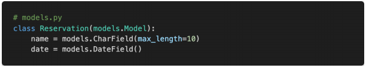
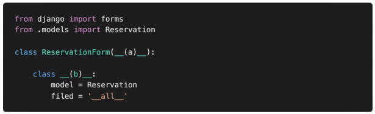
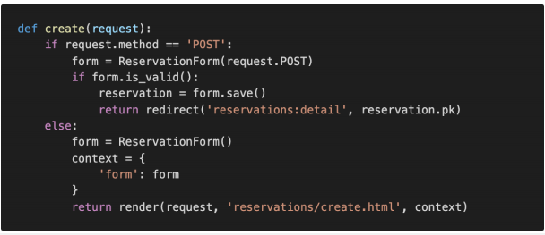
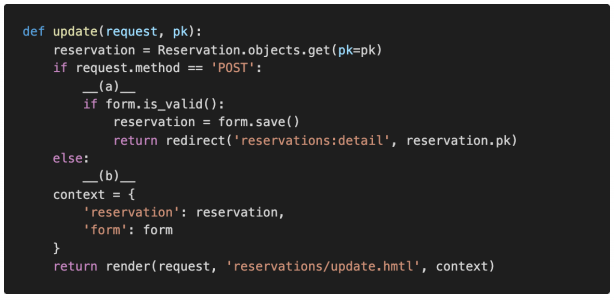
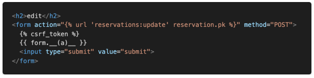

# Django Model Form

​	아래의 코드들을 참고하여 각 문항에 답하시오.



1) Model Form을 정의하기 위해 빈칸에 들어갈 코드를 작성하시오.



```
(a) forms.ModelForm
```

<hr>

2) 글 작성 기능을 구현하기 위해 다음과 같이 코드를 작성하였다.
서버를 실행시킨 후 기능을 테스트 해보니 특정 상황에서 문제가 발생하였다.
이유와 해결방법을 작성하시오.



```
request.method는 POST로 왔으나 if form.is_valid():에서 boolean값이 0일 때, 밖으로 빠져나간 후 다음 동작이 없다. 이를 해결하기 위해 else:문에 있는 context와 return render를 한단계 위로 올려주면 된다.
```

<hr>

3) 글 수정 기능을 구현하기 위해 빈칸에 들어갈 코드를 작성하시오.



```
(a) form = ReservationForm(request.POST, instance=article)
(b) form = ReservationForm(instance=article)
```

<hr>

4) form 출력을 구현하기 위해 빈칸에 들어갈 수 있는 코드를 모두 작성하시오.



```
(a) as_p
```

