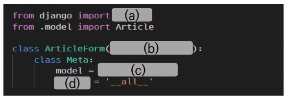

# 1. Form

❖ 각 문항을 읽고 맞으면 T, 틀리면 F를 작성하시오. 

1. ModelForm을 사용할 때 Meta 클래스 내부에 model과 fields 변수는 반드시 작성해야 한다. 
2. ModelForm을 사용할 때는 렌더링 되는 input element 속성은 django에서 제공해주는 대로 사용해야만 한다. 
3. 화면에 나타나는 각 element 위치는 html에서 form.as_p()를 사용하지 않아도 직접 위치시킬 수 있다.

```
1. F (둘 중 하나 이상 작성하면 된다.)
2. F
3. T
```


❖ 다음 빈칸 (a) ~ (d) 에 적합한 코드를 작성하시오.



```
(a) forms
(b) forms.ModelForm
(c) Article
(d) fields
```


❖ Django view 함수가 http POST method 요청만 승인할 수 있도록 하는 데코레이터를 모두 작성하시오.

```
@require_POST()
@require_http_methods("POST")
```

