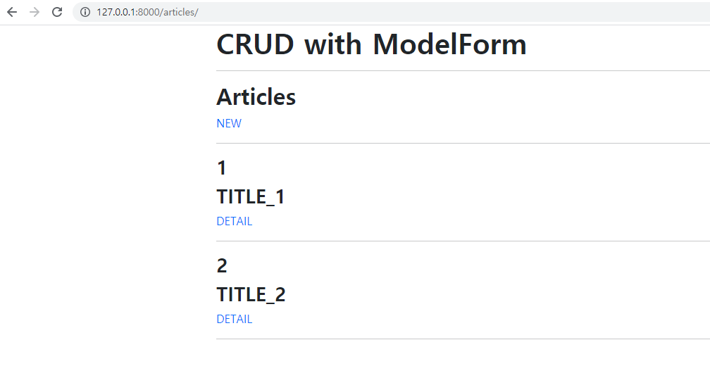

# Form & Static/Media

#### ❖ Django Project 

​	Django Model Form을 활용해 CRUD를 모두 갖춘 장고 프로젝트를 제작하고 결과 사진과 코드를 별도의 마크다운 파일에 작성하여 제출하시오. 


#### ❖ 기본 설정 

	1) 프로젝트 이름은 crud, 앱 이름은 articles로 설정한다.
 	2) 모든 템플릿에서 상속받아 사용할 base.html을 작성한다. 
 	3) base.html이 담긴 templates 디렉토리는 프로젝트 및 앱 디렉토리와 동일한 위치에 생성한다.
 	4) base.html은 Bootstrap CDN을 포함하고 있어야 한다


​	(1) Read



​	(2) Create


​	(3) Detail


​	(4) Update


```python
#views.py

from django.shortcuts import render, redirect, get_object_or_404
from django.views.decorators.http import require_GET

from .models import Article
from .forms import ArticleForm

# Create your views here.
# index
def index(request):
    articles = Article.objects.all()
    context = {
        'articles': articles,
    }
    return render(request, 'articles/index.html', context)


def create(request):
    #method가 POST일 때 저장
    if request.method == "POST":
        form = ArticleForm(request.POST)
        if form.is_valid():
            form.save()
            return redirect('articles:index')
    else:
    #공란이 있을 경우 다시 작성(form.is_valid()로 인해 채워달라고 요청옴)
        form = ArticleForm()
    context = {
        'form': form,
    }
    return render(request, 'articles/form.html', context)


def detail(request, pk):
    #pk를 받아와 그에 따른 정보 표출
    article = Article.objects.get(pk=pk)
    context = {
        'article': article,
    }
    return render(request, 'articles/detail.html', context)


def update(request, pk):
    article = Article.objects.get(pk=pk)
    if request.method == 'POST':
        #new와 같지만 기존 내용을 가져오기 위해 instance=article을 추가
        form = ArticleForm(request.POST, instance=article)
        if form.is_valid():
            form.save()
            return redirect('articles:detail', pk)
    else:
        form = ArticleForm(instance=article)
    context = {
        'form': form,
    }
    return render(request, 'articles/form.html', context)


def delete(request, pk):
    #method가 POST일 때만 삭제하고 index페이지로 가고, 아닐 경우 detail 페이지로 감
    if request.method == 'POST':
    	article = Article.objects.get(pk=pk)
        article.delete()
        return redirect('articles:index')
    
    return redirect('articles:detail', pk)
```

