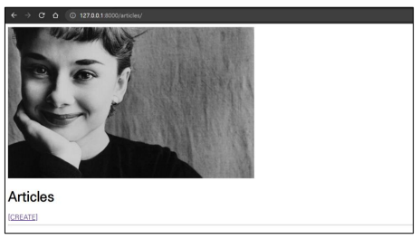
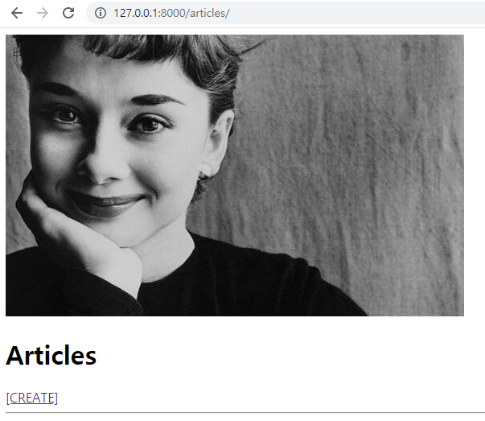
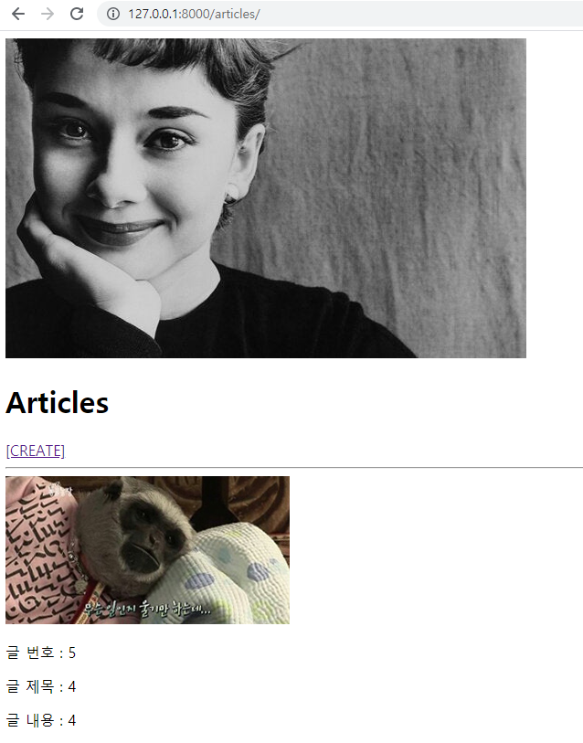

# Static/Media

❖ 사전 제공되는 Django 프로젝트를기반으로아래 문제를 순서대로 해결하고, 해결하는데 필요한코드를 작성하시오.



1. 스크린 샷과 달리 index 페이지에서메인 이미지가 출력되지않는다. 이를 해결하시오.



```python
#이 코드를 추가함
STATICFILES_DIRS = [
    BASE_DIR / 'static',
]
```

2. 이미지를 첨부하여게시글을 작성해보자. 게시글은 작성되는듯 하지만 “업로드된 이미지가 없습니다!” 라는 문구가 출력된다. 올바르게 이미지가 업로드 되어 index 페이지 각 게시글에 출력 될 수 있도록 이를 해결하시오.



```python
# startproject의 urls.py에 추가한 코드

from django.conf import settings
from django.conf.urls.static import static
```

```python
# urlpatterns 뒤에 붙인 코드
+ static(settings.MEDIA_URL, document_root=settings.MEDIA_ROOT)
```
