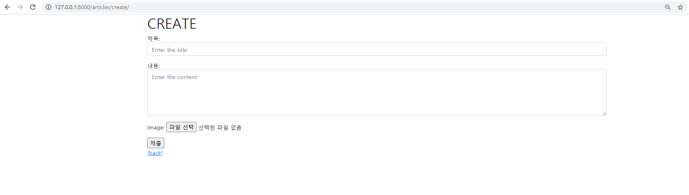

# Static/Media

 ❖ Django Project Django Model Form을 활용해 CRUD를 모두 갖춘 장고 프로젝트를 제작하고 결과 사진과 코드를 별도의 마크다운 파일에 작성하여 제출하시오. 

❖ 기본 설정 1) 프로젝트 이름은 crud, 앱 이름은 articles로 설정한다. 2) 모든 템플릿에서 상속받아 사용할 base.html을 작성한다. base.html이 담긴 templates 디렉토리는 프로젝트 및 앱 디렉토리와 동일한 위치에 생성한다. base.html은 Bootstrap CDN을 포함하고 있어야 한다.





```python
from django.shortcuts import render, redirect, get_object_or_404
from django.views.decorators.http import require_http_methods, require_POST, require_safe
from .models import Article
from .forms import ArticleForm

# Create your views here.
@require_safe
def index(request):
    articles = Article.objects.order_by('-pk')
    
    context = {
        'articles': articles,
    }
    return render(request, 'articles/index.html', context)


@require_http_methods(['GET', 'POST'])
def create(request):
    if request.method == 'POST':
        form = ArticleForm(request.POST, request.FILES)
        if form.is_valid():
            article = form.save()
            return redirect('articles:detail', article.pk)
    else:
        form = ArticleForm()
    context = {
        'form': form,
    }
    return render(request, 'articles/create.html', context)


@require_safe
def detail(request, pk):
    article = Article.objects.get(pk=pk)
    context = {
        'article': article,
    }
    return render(request, 'articles/detail.html', context)


@require_POST
def delete(request, pk):
    article = Article.objects.get(pk=pk)
    article.delete()
    return redirect('articles:index')


@require_http_methods(['GET', 'POST'])
def update(request, pk):
    article = Article.objects.get(pk=pk)
    if request.method == 'POST':
        form = ArticleForm(request.POST,  request.FILES, instance=article)
        if form.is_valid():
            form.save()
            return redirect('articles:detail', article.pk)
    else:
        form = ArticleForm(instance=article)
    context = {
        'article': article,
        'form': form,
    }
    return render(request, 'articles/update.html', context)
```

