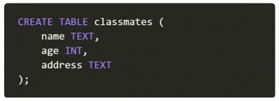

# 1. SQL 용어 및 개념

아래의 보기에서 각 문항의 설명에 맞는 용어를 고르시오.

```
기본키 테이블 스키마 레코드 컬럼
```

1) 관계형 데이터베이스에서 구조와 제약조건에 관련한 전반적인 명세를 기술 한 것 
2) 열과 행의 모델을 사용해 조직된 데이터 요소들의 집합 
3) 고유한 데이터 형식이 지정되는 열
4) 단일 구조 데이터 항목을 가리키는 행 
5) 각 행의 고유값

```
1) 스키마
2) 테이블
3) 컬럼
4) 레코드
5) 기본키
```


# 2. SQL 문법

아래의 보기 (1) ~ (4) 중에서, DML이 아닌 것을 고르시오.

(1) CREATE 

(2) UPDATE 

(3) DELETE 

(4) SELECT

```
(1) CREATE
```


# 3. Relational DBMS

RDBMS의 개념적 정의와 이를 기반으로 한 DB-Engine의 종류 세가지 이상 작성하시오.

```
Relational Database Management System의 약자로, 관계형 모델을 기반으로 하는 데이터베이스 관시시스템을 의미한다. 예시 종류로는 MySQL, SQLite, ORACLE 등이 있습니다.
```


# 4. INSERT INTO

다음과 같은 스키마를 가지는 테이블이 있을 때, 아래의 보기 (1) ~ (4) 중 틀린 문장을 고르시오.



(1) INSERT INTO classmates (name, age, address) VALUES(‘홍길동’, 20, ‘seoul’); 

(2) INSERT INTO classmates VALUES(‘홍길동’, 20, ‘seoul’); 

(3) insert into classmates values(address=‘seoul’, age=20, name=‘홍길동’); 

(4) insert into classmates (address, age, name) values(‘seoul’, 20, ‘홍길동’);

```
(3) insert into classmates values(address=‘seoul’, age=20, name=‘홍길동’); 
```


# 5. 와일드카드 문자

SQL에서 사용가능한 와일드카드 문자인 %와 _을 비교하여 작성하시오

```
%는 어떠한 내용이 있든 없든 상관없다는 의미이다.
_는 한개의 글씨가 무조건 있어야한다는 의미이다.
예를 들어 'a%'는 a로 시작하는 모든 글자, '%a%'는 중간에 a가 있는 모든 글자, '%a'는 a로 끝나는 모든 글자를 의미한다.
'a_'는 a로 시작하는 두글자, '_a_'는 a가 두번째에 있는 세글자, '_a'는 a로 끝나는 두글자를 의미한다.
```

