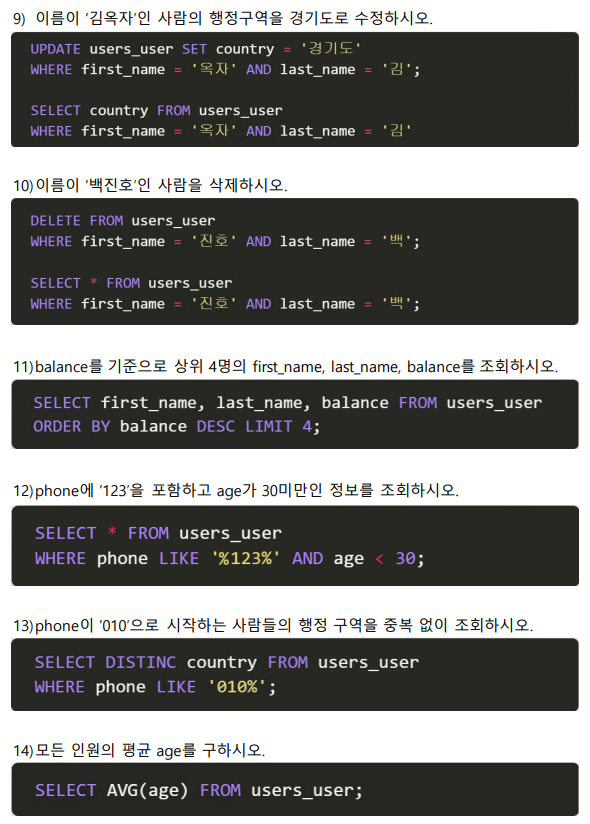

# 1. SQL Query


위 countries 테이블을 바탕으로 아래 문제에 해당하는 SQL query문을 작성하고 실행하시오. 

1) countries 테이블을 생성하시오.
2) 데이터를 입력하시오. 
3) 테이블의 이름을 hotels로 변경하시오. 
4) 객실 가격을 내림차순으로 정렬하여 상위 2개의 room_num과 price를 조회하시오. 
5) grade 별로 분류하고 분류된 grade 개수를 내림차순으로 조회하시오. 
6) 객실의 위치가 지하 혹은 등급이 deluxe인 객실의 모든 정보를 조회하시오. 
7) 지상층 객실이면서 2020년 1월 4일에 체크인 한 객실의 목록을 price 오름차순으로 조회하시오.

```sql
1) 
CREATE TABLE countries(
room_num TEXT,
check_in TEXT,
check_out TEXT,
grade TEXT,
price INTEGER
);

2)
INSERT INTO countries
VALUES ('B203', '2019-12-31', '2020-01-03', 'suite', 900);

INSERT INTO countries
VALUES ('1102', '2020-01-04', '2020-01-08', 'suite', 850);

INSERT INTO countries
VALUES ('303', '2020-01-01', '2020-01-03', 'deluxe', 500);

INSERT INTO countries
VALUES ('807', '2020-01-04', '2020-01-07', 'superior', 300);

/*
밑에와 같이 붙여써도 동작
INSERT INTO countries
VALUES ('B203', '2019-12-31', '2020-01-03', 'suite', 900),
VALUES ('1102', '2020-01-04', '2020-01-08', 'suite', 850),
VALUES ('303', '2020-01-01', '2020-01-03', 'deluxe', 500),
VALUES ('807', '2020-01-04', '2020-01-07', 'superior', 300);
*/


3)
ALTER TABLE countries
RENAME TO hotels;

4)
SELECT room_num, price FROM hotels ORDER BY price DESC LIMIT 2;

5)
SELECT grade, COUNT(grade)
FROM hotels 
GROUP BY grade
ORDER BY COUNT(grade) DESC;

6)
SELECT * FROM hotels
WHERE grade='deluxe' OR room_num LIKE 'B%';

7)
SELECT * FROM hotels
WHERE room_num NOT LIKE 'B%' AND check_in = '2020-01-04'
ORDER BY price;
```


# 2. SQL ORM 비교하기

주어진 정보를 활용하여 작성된 SQL문과 대응하는 ORM문을 작성하고 실행하시오. 


```sql
1) User.objects.all()
2) User.objects.filter(id=19).values('age')
3) User.objects.values('age')
4) User.objects.filter(age__lte=40).values('id', 'balance')
5) User.objects.filter(last_name='김', balance__gte=500).values('first_name')
6) User.objects.filter(first_name__endswith='수', country='경기도').values('balance')
   User.objects.values('balance').filter(first_name__endswith='수', country='경기도')
7) User.objects.filter(Q(balance__gte=2000)|Q(age__lte=40)).count()
8) User.objects.filter(phone__startswith='010').count()
```




```sql
9) User.objects.filter(first_name='옥자', last_name='김').update(country='경기도')
	/*user = User.objects.filter(first_name='옥자', last_name='김')
	uwser.country = '경기도'
	user.save()*/
10) User.objects.filter(first_name='진호', last_name='백').delete()
11) User.objects.order_by('-balance').values('first_name', 'last_name', 'balance')[:5]
12) User.objects.filter(age__lt=30, phone__contains='123')
13) User.objects.filter(phone__startswith='010').values('country').distinct()
14) User.objects.aggregate(Avg('age'))
	User.objects.aggregate(age_avg=Avg('age'))
```


```
15) User.objects.filter(last_name='박').aggregate(Avg('balance'))
16) User.objects.filter(country='경상북도').order_by('-balance')[0]
	User.objects.filter(country='경상북도').aggregate(Max('balance'))
17) User.objects.filter(country='제주특별자치도').values('first_name').order_by('-balance')[0]
	User.objects.filter(country='제주특별자치도').order_by('-balance').values('first_name').[:1]
```


