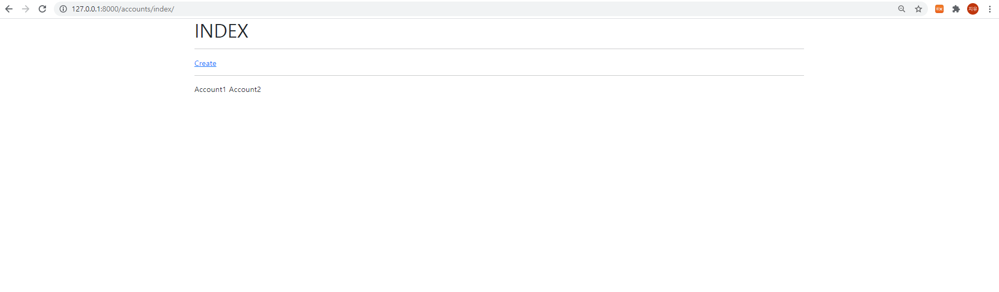
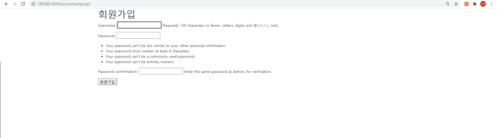

# Django Authentication System

### ❖ Accounts CR

1. /accounts/ 

   유저 목록을 출력하는 페이지를 나타낸다.

2. /accounts/signup/ 

   회원가입 작성을 위한 페이지를 나타낸다. 유저를 생성하는 기능을 수행한다.

### ❖ 제출 방법 

​	views.py에 작성한 코드와 각 페이지의 결과 사진을 마크다운에 작성하여 제출한다.

```python
# views.py

from django.contrib.auth.models import User
from django.shortcuts import render, redirect
from django.contrib.auth.forms import UserCreationForm

# Create your views here.

def index(request):
    # 계정 db의 데이터를 가져옴
    accounts = User.objects.all()
    context = {
        'accounts': accounts    
    }
    return render(request, 'accounts/index.html', context)


def signup(request):
    if request.method == 'POST':
        # 장고에서 제공하는 폼 사용
        form = UserCreationForm(request.POST)
        if form.is_valid():
            form.save()
            return redirect('accounts:index')
        pass
    else:
        form = UserCreationForm()
    context = {
        'form': form,
    }
    return render(request, 'accounts/signup.html', context)
```




