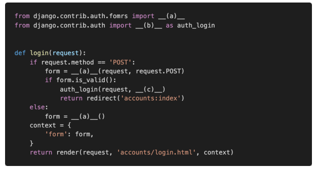
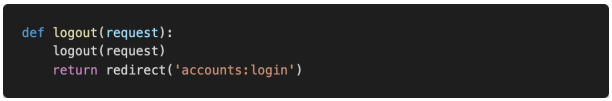

# 1. User Model BooleanField

django에서 기본적으로 사용하는 User 모델은 AbstractUser 모델을 상속받아 정의된다.

```python
class User(AbstractUser):
    """
    Users within the Django authentication system are represented by this
    model.
    Username and password are required. Other fields are optional.
    """
    class Meta(AbstractUser.Meta):
        swappable = 'AUTH_USER_MODEL'
```

• 아래의 models.py를 참고하여 User 모델에서 사용할 수 있는 칼럼 중 BooleanField 로 정의 된 컬럼을 모두 작성하시오.

```
is_superuser, is_staff, is_active
```


# 2. username max length

django에서 기본적으로 사용하는 User 모델의 username 컬럼이 저장할 수 있는 최대 길이를 작성하시오.

```python
username = models.CharField(
        _('username'),
        max_length=150,
        unique=True,
        help_text=_('Required. 150 characters or fewer. Letters, digits and @/./+/-/_ only.'),
        validators=[username_validator],
        error_messages={
            'unique': _("A user with that username already exists."),
        },
    )
    
# max_length = 150 (최대길이는 150)
```


# 3. login validation

단순히 사용자가 ‘로그인 된 사용자인지’만을 확인하기 위하여 User 모델 내부에 정의된 속성의 이름을 작성하시오.

```python
def is_authenticated(self):
        return False
    
# is_authenticated
```


# 4. Login 기능 구현

다음은 로그인 기능을 구현한 코드이다. 빈 칸에 들어갈 코드를 작성하시오.



```
(a)	AuthenticationForm
(b) login
(c) form.get_user()
```


# 5. who are you?

```
AnonymousUser
```


# 6. 암호화 알고리즘

Django에서 기본적으로 User 객체의 password 저장에 사용하는 알고리즘, 그리고 함께 사용된 해시 함수를 작성하시오.

```
Pbkdf2, Sha256
```


# 7. Logout 기능 구현

로그아웃 기능을 구현하기 위하여 다음과 같이 코드를 작성하였다. 로그아웃 기능을 실행 시 문제가 발생한다고 할 때 그 이유와 해결 방법을 작성하시오



```
호출한 logout함수가 def logout함수와 겹쳐서 오류가 발생했다.
이를 해결하기 위해 함수를 불러오는 부분을 다음과 같이 수정하고 auth_logout(request)를 작성하면 된다.
from django.contrib.auth import logout as auth_logout
```

