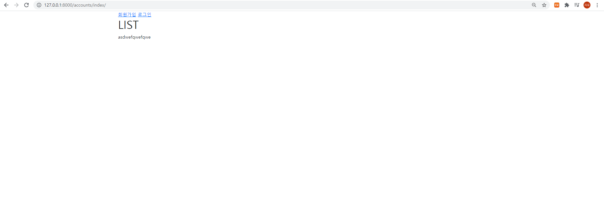
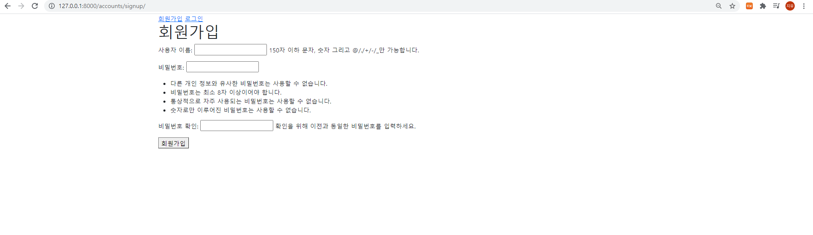
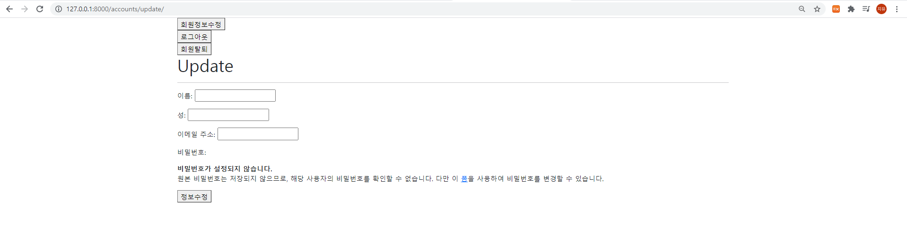
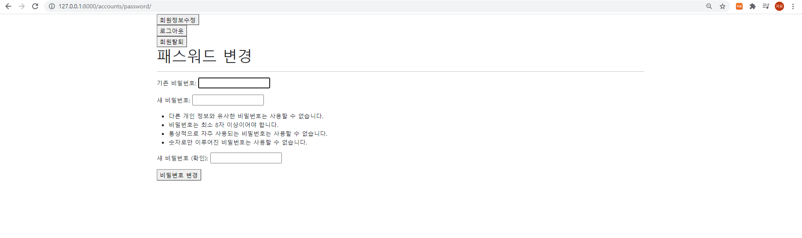

# Django Authentication System

1.  User Change Password

   /accounts/password/ 형식의 url을 가지며, 유저의 비밀번호 수정 기능을 구현한다.

### ❖ 제출 방법

​	views.py에 작성한 코드와 각 페이지의 결과 사진을 마크 다운에 작성하여 제출한다.

```python
from django.shortcuts import render, redirect
from django.contrib.auth.forms import (
    UserCreationForm, AuthenticationForm,
    PasswordChangeForm
)
from .forms import CustomUserChangeForm
from django.contrib.auth import login as auth_login
from django.contrib.auth import logout as auth_logout
from django.contrib.auth import update_session_auth_hash
from django.views.decorators.http import require_POST
from django.contrib.auth.decorators import login_required
from django.contrib.auth.models import User

# Create your views here.

def index(request):
    # 계정 db의 데이터를 가져옴
    accounts = User.objects.all()
    context = {
        'accounts': accounts
    }
    return render(request, 'accounts/index.html', context)

def signup(request):
    # 로그인 돼있을 때 비활성화
    if request.user.is_authenticated:
        return redirect('accounts:index')
    if request.method == 'POST':
		# 장고에서 제공하는 폼 사용
        form = UserCreationForm(request.POST)
        if form.is_valid():
            form.save()
            return redirect('accounts:index')
        pass
    else:
        form = UserCreationForm()

    context = {
        'form': form,
    }
    return render(request, 'accounts/signup.html', context)


def login(request):
    if request.user.is_authenticated:
        return redirect('accounts:index')
    if request.method == 'POST':
        form = AuthenticationForm(request, request.POST)
        if form.is_valid():
            auth_login(request, form.get_user())
            return redirect('accounts:index')
        pass
    else:
        form = AuthenticationForm()

    context = {
        'form': form,
    }
    return render(request, 'accounts/login.html', context)

@require_POST
def logout(request):
    if request.user.is_authenticated:
        auth_logout(request)
    return redirect('accounts:index')


@login_required
def update(request):
    if request.method == 'POST':
        # 장고에서 제공하는 폼은 여러가지 데이터가 많아 필요한 폼으로 커스텀
        # forms에서 수정하여 클래스 지정
        form = CustomUserChangeForm(request.POST, instance=request.user)
        if form.is_valid():
            form.save()
            return redirect('accounts:index')
        pass
    else:
        form = CustomUserChangeForm(instance=request.user)

    context = {
        'form': form,
    }
    return render(request, 'accounts/update.html', context)


@require_POST
def delete(request):
    if request.user.is_authenticated:
        request.user.delete()
        # 삭제하면서 로그아웃도 하도록 설정
        auth_logout(request)
    return redirect('accounts:index')

@login_required
def chg_pw(request):
    if request.method == 'POST':
        form = PasswordChangeForm(request.user, request.POST)
        if form.is_valid():
            user = form.save()
            # 비밀번호를 바꿔도 로그아웃이 되지 않고록 재갱신
            update_session_auth_hash(request, user)
            return redirect('accounts:index')
    else:
        form = PasswordChangeForm(request.user)

    context = {
        'form': form,
    }
    return render(request, 'accounts/chg_pw.html', context)
```









