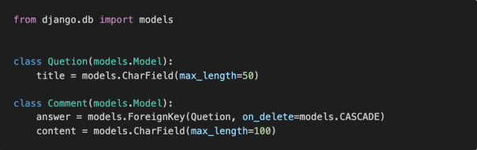
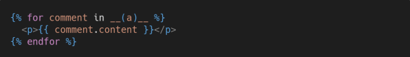
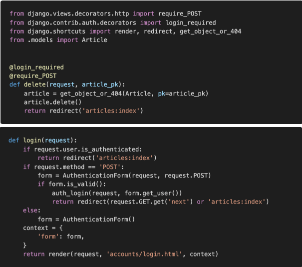

# 1. 1:N True of False

 각 문항을 읽고 맞으면 T, 틀리면 F를 작성하고 틀렸다면 그 이유도 함께 작성하시오. 

1) ForeignKey는 부모 테이블의 데이터를 참조하기 위한 키이다. 
2) 1:N 관계에서 1은 N의 데이터를 직접 참조 할 수 있다. 
3) on_delete 속성은 ForeignKey 필드의 필수 인자이다.
4) 1:N 관계에서 외래 키는 반드시 부모 테이블의 PrimaryKey여야 한다.

```
1. T
2. F (직접 참조할 수 없고 장고에서 제공하는 함수로 참조할 수 있다.(ex: commend_set.all()))
3. T
4. T
```


# 2. ForeignKey column name

 다음과 같이 이름이 articles인 app의 models.py에 작성된 코드를 바탕으로 테이블이 만들어 졌을 때, 데이터베이스에 저장되는 ForeignKey 컬럼의 이름과 테이블의 이름이 무엇인지 작성하시오.



```
answer, Comment
```


# 3. 1:N model manager

 위 2번 문제 모델 관계를 바탕으로 어느 template 페이지가 다음과 같이 작성되어 있을 때, 질문(Question)에 작성된 모든 댓글(Comment)을 출력하고자 한다. 해당 template에서 Question 객체를 사용할 수 있다면 빈칸 __(a)__에 들어갈 알맞은 코드를 작성하시오.



```
title
```


# 4. next parameter

다음과 같이 게시글을 삭제하는 delete 함수와 로그인을 위한 login 함수가 작성되어 있다. 만약 비로그인 사용자가 삭제를 시도한다면, django는 해당 사용자를 url에 next 파라미터가 붙은 login 페이지로 redirect 한다. 

▪ /accounts/login/?next=/articles/1/delete/ 

1) redirect된 로그인 페이지에서 로그인에 성공했을 때 발생하는 HTTP response status code를 작성하고, 이 오류가 발생한 원인을 작성하시오. 
2) 위에서 발생한 오류를 해결하기 위해 다음과 같이 동작하는 코드로 수정하시오.

 ▪ 게시글 삭제는 HTTP POST method로만 가능하다.

 ▪ 인증되지 않은 사용자가 게시글 삭제를 시도하는 경우, 해당 게시글 상세페이지로 redirect 되도록 한다.

​	 (게시글은 삭제되지 않는다.)



```
1. HTTP ERROR 405, 로그인 후 next에 따른 값에 이동하는데 GET으로 가져와서 POST방식을 요구하는 delete가 동작하지 않았다.

2. delete함수에서 @login_required 데코를 사용하지 않고 if request.user.is_authenticated:를 사용한다.
```

