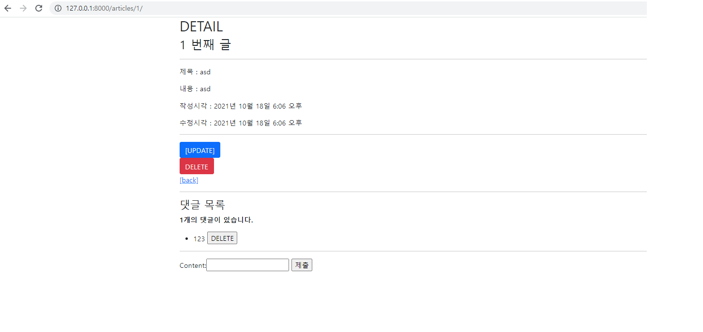

# Django Model Relationship

❖ Django Project 사전 제공되는 프로젝트를 사용해 아래 해당하는 조건을 모두 구현하시오. 

댓글 기능을 구현한다. 

1. 각 게시글에는 여러 댓글이 작성될 수 있다. 

2. 댓글 모델은 댓글내용, 작성시간, 수정시간 컬럼을 가지고 있다. 

3. 댓글목록은 detail 페이지에서 출력되며 같은 곳에서 작성할 수 있다. 

4. 각 댓글은 삭제 할 수 있다.




```python
#views.py

from django.shortcuts import render, redirect, get_object_or_404
from .models import Article, Comment
from .forms import ArticleForm, CommentForm
from django.views.decorators.http import require_POST, require_safe

# Create your views here.
def index(request):
    articles = Article.objects.order_by('-pk')
    context = {
        'articles': articles,
    }
    return render(request, 'articles/index.html', context)


def create(request):
    if request.method == 'POST':
        form = ArticleForm(request.POST)
        if form.is_valid():
            article = form.save()
            return redirect('articles:detail', article.pk)
    else:
        form = ArticleForm()
    context = {
        'form': form,
    }
    return render(request, 'articles/create.html', context)


@require_safe
def detail(request, pk):
    article = get_object_or_404(Article, pk=pk)
    comment_form = CommentForm()
    comments = article.comment_set.all()
    context = {
        'article': article,
        'comment_form': comment_form,
        'comments': comments,
    }
    return render(request, 'articles/detail.html', context)


def delete(request, pk):
    article = get_object_or_404(Article, pk=pk)
    article.delete()
    return redirect('articles:index')


def update(request, pk):
    article = get_object_or_404(Article, pk=pk)
    if request.method == 'POST':
        form = ArticleForm(request.POST, instance=article)
        if form.is_valid():
            form.save()
            return redirect('articles:detail', article.pk)
    else:
        form = ArticleForm(instance=article)
    context = {
        'form': form,
        'article': article,
    }
    return render(request, 'articles/update.html', context)

@require_POST
def comments_create(request, pk):
    article = get_object_or_404(Article, pk=pk)
    comment_form = CommentForm(request.POST)
    if comment_form.is_valid():
        comment = comment_form.save(commit=False)
        comment.article = article
        comment.save()
    return redirect('articles:detail', article.pk)


@require_POST
def comments_delete(request, article_pk, comment_pk):
    comment = get_object_or_404(Comment, pk=comment_pk)
    comment.delete()
    return redirect('articles:detail', article_pk)
```

