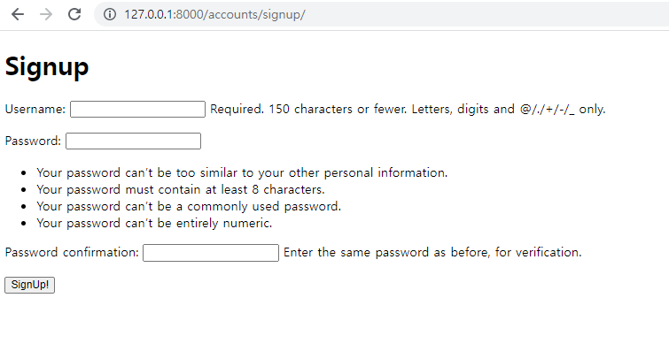
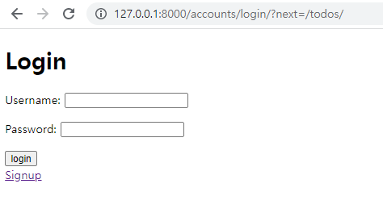
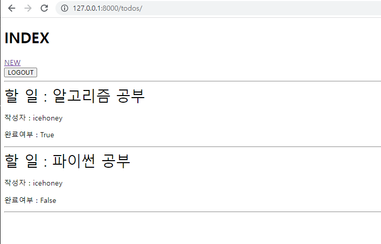
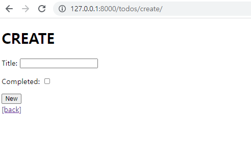

# Model Relationship

❖ Todo App Project 아래 명세를 만족하는 Todo App을 제작하시오. 

❖ Model 아래 ERD를 참고하여 todo 테이블을 정의한다. 

❖ 필수 조건 

​	• User 모델은 django의 내장 User 모델을 대체하여 사용한다.


## 1. 회원가입



## 2. 로그인



## 3. Todo목록(index)



## 4. Todo 생성(new)



```python
#todos/views.py
from django.shortcuts import render, redirect
from .forms import TodoForm
from django.contrib.auth.decorators import login_required
from .models import Todo
from django.views.decorators.http import require_http_methods

# Create your views here.

@login_required
def index(request):
    todos = Todo.objects.all()
    
    context = {
        'todos': todos,
    }
    return render(request, 'todos/index.html', context)


@login_required
@require_http_methods(['GET', 'POST'])
def create(request):
    if request.method == 'POST':
        form = TodoForm(request.POST)
        if form.is_valid():
            todo = form.save(commit=False)
            todo.user = request.user
            todo.save()
            return redirect('todos:index')
    else:
        form = TodoForm()
    context = {
        'form': form,
    }
    return render(request, 'todos/create.html', context)
```

```python
# todos/models.py
from django.db import models
from django.conf import settings
# Create your models here.

class Todo(models.Model):
    title = models.TextField()
    completed = models.BooleanField()
    user = models.ForeignKey(settings.AUTH_USER_MODEL, on_delete=models.CASCADE)
```

