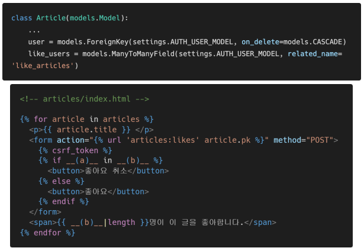
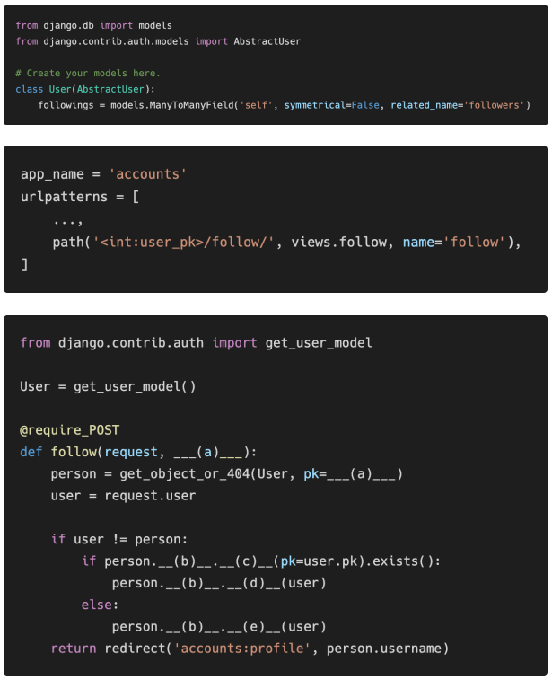
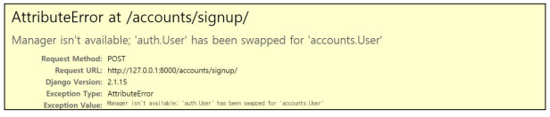
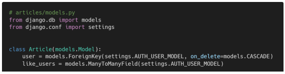

# Django Model Relationship

### 1. 1:N True of False

 각 문항을 읽고 맞으면 T, 틀리면 F를 작성하고, 틀렸다면 그 이유도 함께 작성하시오.

1) Django에서1:N 관계는 ForeignKeyField를 사용하고, M:N 관계는 ManyToManyField를 사용한다. 
2) ManyToManyField를 설정하고 만들어지는 테이블 이름은 “앱이름 _ 클래스이름 _ 지정한 필드이름”의 형태로 만들어진다. 
3) ManyToManyField의 첫번째 인자는 참조할 모델, 두번째 인자는 related_name이 작성 되는데 두 가지 모두 필수적으로 들어가야 한다.

```
1. T
2. T
3. F (related_name은 중복되지 않는 이상 선택사항이다.)
```


### 2. Like in templates

 아래 빈 칸 (a)와 (b)에 들어갈 코드를 각각 작성하시오.



```
(a) : user
(b) : article.like_users.all
```


### 3. Follow in views

 모델 정보가 다음과 같을 때 빈칸 a, b, c, d, e에 들어갈 코드를 각각 작성하시오.



```
(a) : user_pk
(b) : followers.filter
(c) : followers.remove
(d) : followers.add
```


### 4. User AttributeError

 다음과 같은 에러 메시지가 발생하는 이유와 이를 해결하기 위한 방법과 코드를 작성하시오. 



```
User모델을 accounts앱에서 새롭게 만들었고, accounts.User을 사용하는 부분에서 auth.User을 사용해 오류가 발생했다.
새롭게 만든 User을 제거하거나 새롭게 만든 User에 맞는 폼으로 코드를 재작성하면 된다.
```


### 5. related_name

 아래의 경우 ForeignKey 혹은 ManyToManyField에 related_name을 필수적으로 작성해야 한다. 그 이유를 설명하시오.



```
user와 like_users의 역참조의 이름이 article_set으로 같기 때문에 둘 중 하나의 역참조 호출함수를 변경해야한다.
```
