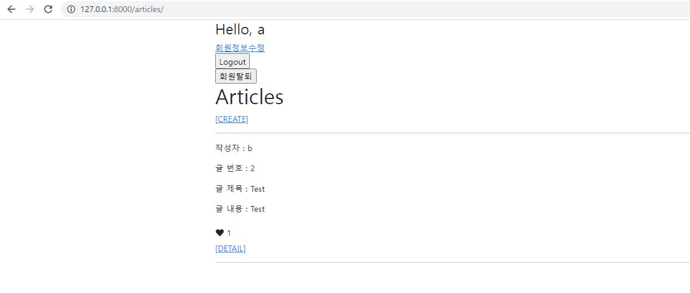
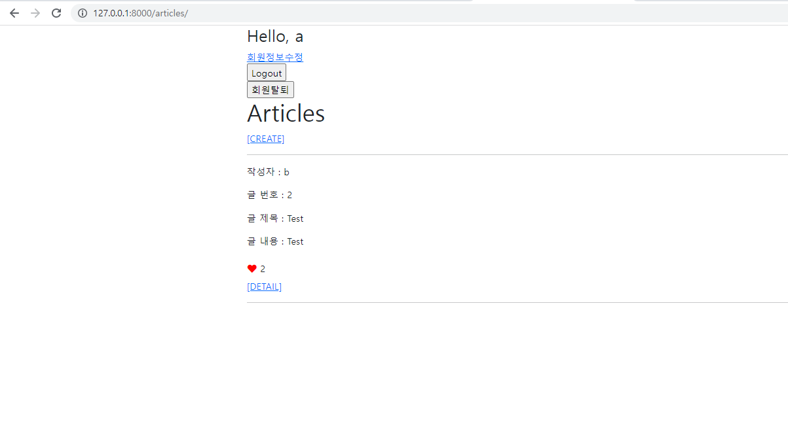

# Django Model Relationship

###   - Background

```
* Web Framework
* Django
```

###  - Goal

```
* 좋아요 기능 구현
```

### - Problem

❖ Django Project 주어진 Django project로 데이터베이스 M:N 관계를 활용해 좋아요 기능을 구현하시오. 

1. Model 좋아요 기능 구현을 위한 모델 관계를 설정한다. 

2. url & view /articles//like/ ▪ 로그인한 유저의 요청만 처리한다.

3. Template font-awesome에서 활용할 로고를 선택한다.

   ▪ 개인 kit를 발급 받은 후 base.html에 붙여 넣는다.

   ▪ 좋아요에 활용되는 하트 로고를 선택한다. index.html에 좋아요 여부에 따른 결과를 보여준다.

   ▪ 좋아요를 누른 경우 빨간색 하트, 그렇지 않은 경우 검은색 하트가 출력 되도록 한다. 

   ▪ 특정 글의 좋아요를 누른 전체 인원수를 출력한다.


❖ 결과 제출 결과 사진과 views.py, models.py, index.html 코드를 마크다운에 작성해서 제출하시오

```python
#articles/views.py

@require_POST
def like(request, article_pk):
    if request.user.is_authenticated:
        article = get_object_or_404(Article, pk=article_pk)
        if request.user in article.like_users.all():
            article.like_users.remove(request.user)
        else:
            article.like_users.add(request.user)
        return redirect('articles:index')
    return redirect('accounts:login')
```

```python
#articles/models.py

class Article(models.Model):
    user = models.ForeignKey(settings.AUTH_USER_MODEL, on_delete=models.CASCADE)
    title = models.CharField(max_length=10)
    content = models.TextField()
    created_at = models.DateTimeField(auto_now_add=True)
    updated_at = models.DateTimeField(auto_now=True)
    like_users = models.ManyToManyField(settings.AUTH_USER_MODEL, related_name='like_articles')

    def __str__(self):
        return self.title
```

```python
#articles/urls.py

from django.urls import path
from . import views


app_name = 'articles'
urlpatterns = [
    path('', views.index, name='index'),
    path('create/', views.create, name='create'),
    path('<int:pk>/', views.detail, name='detail'),
    path('<int:pk>/delete/', views.delete, name='delete'),
    path('<int:pk>/update/', views.update, name='update'),
    path('<int:pk>/comments/', views.comments_create, name='comments_create'),
    path('<int:article_pk>/comments/<int:comment_pk>/delete/', views.comments_delete, name='comments_delete'),
    path('<int:article_pk>/like/', views.like, name='like'),
]
```

```html
<!-- index.html -->




  <h1>Articles</h1>
  
    <a href="">[CREATE]</a>
  
    <a href="">[새 글을 작성하려면 로그인하세요.]</a>
  
  <hr>
  
    <p>작성자 : {{ article.user }}</p>
    <p>글 번호 : {{ article.pk }}</p>
    <p>글 제목 : {{ article.title }}</p>
    <p>글 내용 : {{ article.content }}</p>
    <form action="" method="POST">
      
      
      <button class='btn btn-link ms-0 ps-0 text-decoration-none text-dark'>
        <i class="fas fa-heart" style="color:red"></i>
        {{ article.like_users.all|length }}
      </button>
      
      <button class='btn btn-link ms-0 ps-0 text-decoration-none text-dark'>
        <i class="fas fa-heart"></i>
        {{ article.like_users.all|length }}
      </button>
      
    </form>
    <a href="">[DETAIL]</a>
    <hr>
  

```




