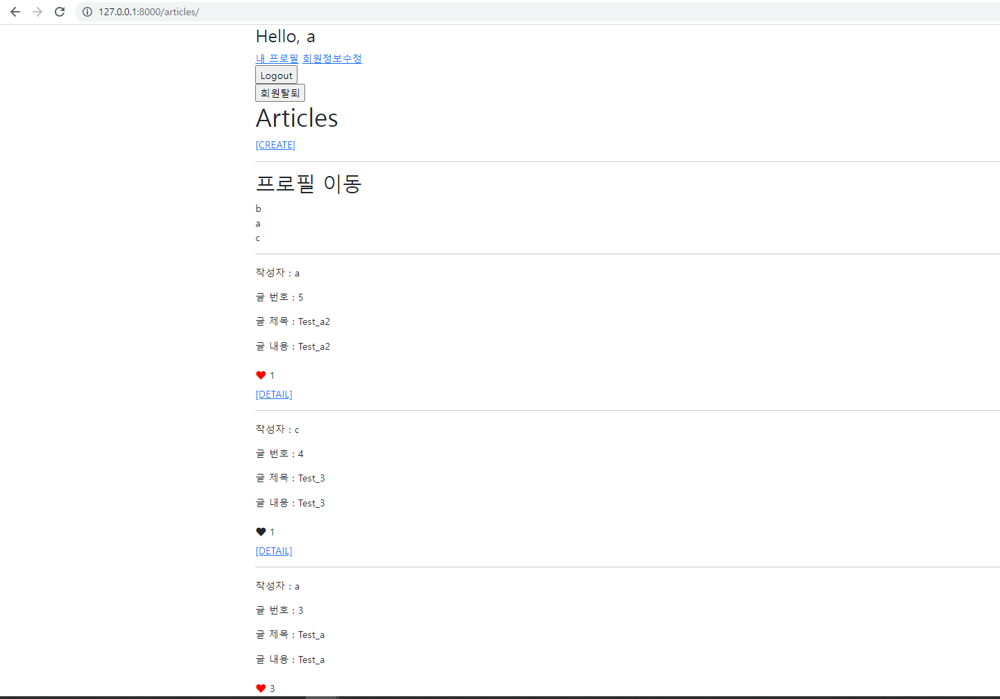
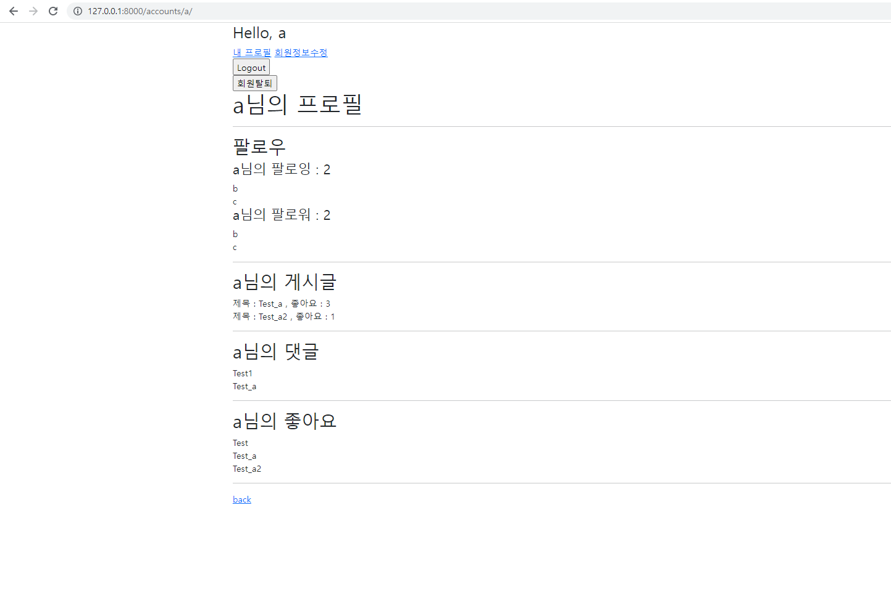
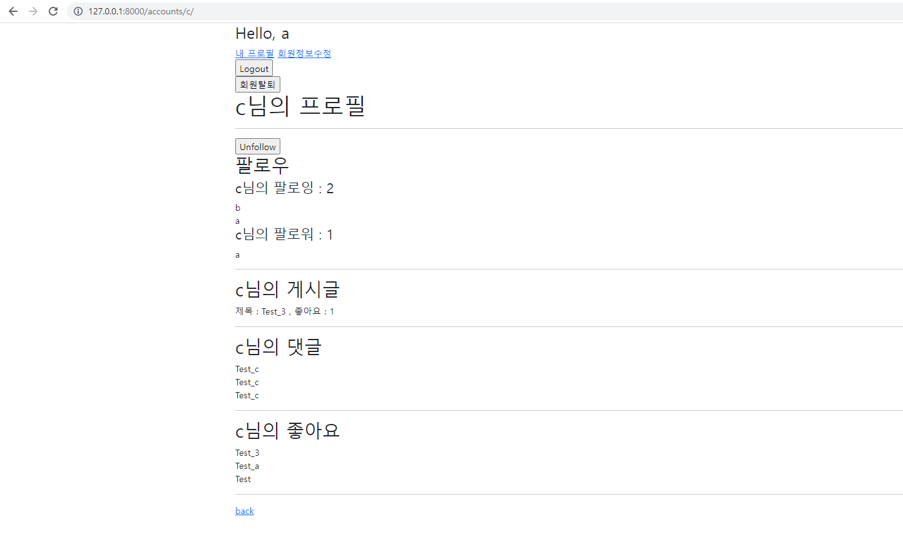

# Django Model Relationship

### - Background

```
* Web Framework
* Django
```

### - Goal

```
* 팔로우 기능 구현
```

### - Problem

❖ Django Project 주어진 Django project로 데이터베이스 M:N 관계를 활용해 팔로우 기능을 구현하시오. 

1. Model 

   팔로우 기능 구현을 위한 모델관계를 설정한다. 

   기본 내장 User 모델을 대체하여 사용한다. 

2. url & view 

   /accounts// 유저 프로필 페이지 기능을 구현한다. 

   ​	▪ 로그인한 유저만 팔로우를 할 수 있다. 

   /accounts//follow/ 팔로우를 하기 위한 기능을 구현한다. 

   ​	▪ 로그인한 유저만 팔로우를 할 수 있다. 

   ​	▪ 본인은 자기 자신을 팔로우를 할 수 없다. 

3. template 

   index.html의 username에 profile로 갈 수 있는 링크를 설정한다. 

   팔로잉 여부에 따라 팔로우와 언팔로우 버튼이 토글 될 수 있도록 구성한다.

   ​	▪ 로그인한 유저 자신의 프로필 페이지에서는 팔로우 & 언팔로우 버튼이 보이지 않는다. 

   ​	▪ 작성자의 팔로잉, 팔로워 숫자를 보여주고 유저의 이름을 모두 출력한다.

4.  선택사항

    해당 프로필 유저가 작성한 모든 글의 제목과 해당 글의 좋아요 개수를 함께 출력한다.

```html
<!-- base.html -->
<div class="container">
    
      <h3>Hello, {{ user }}</h3>
      <a href="">내 프로필</a>
      <a href="">회원정보수정</a>
      <form action="" method="POST">
        
        <input type="submit" value="Logout">
      </form>
      <form action="" method="POST">
        
        <input type="submit" value="회원탈퇴">
      </form>
    
      <a href="">Login</a>
      <a href="">Signup</a>
    

    
    
```

```html
<!-- articles/index.html -->



  <h1>Articles</h1>
  
    <a href="">[CREATE]</a>
  
    <a href="">[새 글을 작성하려면 로그인하세요.]</a>
  
  <hr>
  <h2>프로필 이동</h2>
  
    <a href="" class="text-decoration-none text-dark">{{ username }}</a>
    <br>
    
      <p>유저없음</p>
  
  <hr>
  
    <p>작성자 : 
    <a href="" class="text-decoration-none text-dark">
    {{ article.user.username }}
    </a>
    </p>
    <p>글 번호 : {{ article.pk }}</p>
    <p>글 제목 : {{ article.title }}</p>
    <p>글 내용 : {{ article.content }}</p>
    <form action="" method="POST">
      
      
      <button class='btn btn-link ms-0 ps-0 text-decoration-none text-dark'>
        <i class="fas fa-heart" style="color:red"></i>
        {{ article.like_users.all|length }}
      </button>
      
      <button class='btn btn-link ms-0 ps-0 text-decoration-none text-dark'>
        <i class="fas fa-heart"></i>
        {{ article.like_users.all|length }}
      </button>
      
    </form>
    <a href="">[DETAIL]</a>
    <hr>
  

```

```python
# accounts/views.py
@require_POST
def follow(request, user_pk):
    if request.user.is_authenticated:
        person = get_object_or_404(get_user_model(), pk=user_pk)
        if person != request.user:
            if request.user in person.followers.all():
                person.followers.remove(request.user)
            else:
                person.followers.add(request.user)
        return redirect('accounts:profile', person.username)
    return redirect('accounts:login')
```

```python
# accounts/urls.py
from django.urls import path
from . import views


app_name = 'accounts'
urlpatterns = [
    path('login/', views.login, name='login'),
    path('logout/', views.logout, name='logout'),
    path('signup/', views.signup, name='signup'),
    path('delete/', views.delete, name='delete'),
    path('update/', views.update, name='update'),
    path('password/', views.change_password, name='change_password'),
    path('<username>/', views.profile, name='profile'),
    path('<int:user_pk>/follow/', views.follow, name='follow'),
]
```

```python
# accounts/models.py
from django.db import models
from django.contrib.auth.models import AbstractUser

# Create your models here.
class User(AbstractUser):
    followings = models.ManyToManyField('self', symmetrical=False, related_name='followers')
```

```html
<!-- accounts/profile.html -->


<h1>{{ person.username }}님의 프로필</h1>
<hr>
<div>

  <div>
      <form action="" method="POST">
      
      
        <input type="submit" value="Unfollow">
      
        <input type="submit" value="follow">
      
    </form>
  </div>

</div>
<h2>팔로우</h2>
<h4>{{ person.username }}님의 팔로잉 : {{ person.followings.all|length }}</h4>

{{ following.username }}
<br>



<h4>{{ person.username }}님의 팔로워 : {{ person.followers.all|length }}</h4>

{{ follower.username }}
<br>


<hr>
<h2>{{ person.username }}님의 게시글</h2>

제목 : {{ article.title }}
, 좋아요 : {{ article.like_users.all|length }}
<br>

없음

<hr>

<h2>{{ person.username }}님의 댓글</h2>

{{ comment.content }}
<br>

없음

<hr>

<h2>{{ person.username }}님의 좋아요</h2>

{{ article.title }}
<br>

없음

<hr>
<a href="">back</a>

```

### Picture

- articles(index페이지)



- accounts/username(본인 프로필페이지)



- accounts/username(타인 프로필페이지)


