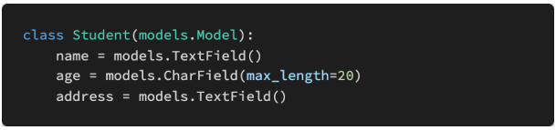

# Django REST Framework

### 1. 아래의 설명을 읽고 T/F 여부를 작성 후 이유를 설명하시오. 

- URI는 정보의 자원을 표현하고, 자원에 대한 행위는 HTTP Method로 표현한다.
- HTTP Method는 GET과 POST 두 종류 뿐이다. 
- ‘https://www.fifa.com/worldcup/teams/team/43822/create/’는 계층 관계를 잘 표현한 RESTful한 URI라고 할 수 있다. 

```
1. T
2. F - GET, POST, PUT, DELETE 등이 있다.
3. F - 마지막에 /가 있다
```

### 2. 다음의 HTTP status code의 의미를 간략하게 작성하시오. 

```
- 200 : 요청이 성공적으로 되었습니다.(OK)
- 400 : 이 응답은 잘못된 문법으로 인하여 서버가 요청을 이해할 수 없음을 의미합니다.(Bad Request)
- 401 : 클라이언트는 요청한 응답을 받기 위해서는 반드시 스스로를 인증해야 합니다.(Unauthorized)
- 403 : 클라이언트는 콘텐츠에 접근할 권리를 가지고 있지 않습니다.(Forbidden)
- 404 : 서버는 요청받은 리소스를 찾을 수 없습니다.(Not Found)
- 500 : 서버가 처리 방법을 모르는 상황이 발생했습니다.(Internal Server Error)
```

### 3. 아래의 모델을 바탕으로 ModelSerializer인 StudentSerializer class를 작성하시오.



```python
class StudentSerializer(serializers.ModelSerializer):
    class Meta:
        model = Student
        fields = '__all__'
```


### 4. Serializers의 의미를 DRF(Django REST Framework) 공식 문서를 참고하여 간단하게 설명하시오.

```
 직렬 변환기를 사용하면 쿼리 세트 및 모델 인스턴스와 같은 복잡한 데이터를 네이티브 Python 데이터 유형으로 변환한 다음 JSON, XML또는 다른 콘텐츠 유형 으로 쉽게 렌더링할 수 있습니다. 직렬 변환기는 또한 역직렬화를 제공하여 먼저 들어오는 데이터의 유효성을 검사한 후 구문 분석된 데이터를 복합 유형으로 다시 변환할 수 있습니다.

 REST 프레임워크의 직렬 변환기는 Django Form및 ModelForm클래스 와 매우 유사하게 작동 합니다. 우리는 Serializer응답의 출력을 제어하는 강력하고 일반적인 방법을 ModelSerializer제공하는 클래스와 모델 인스턴스 및 쿼리 세트를 처리하는 직렬 변환기를 만드는 데 유용한 바로 가기를 제공하는 클래스를 제공합니다.
```

