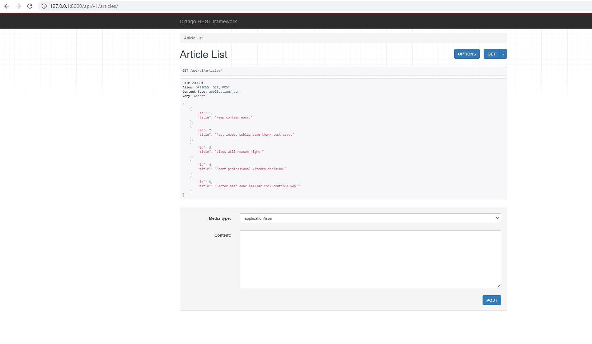
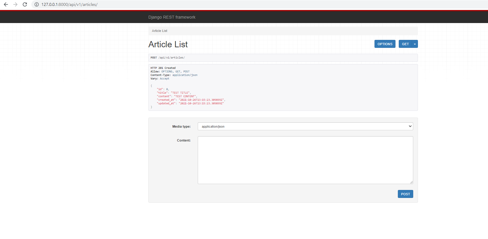
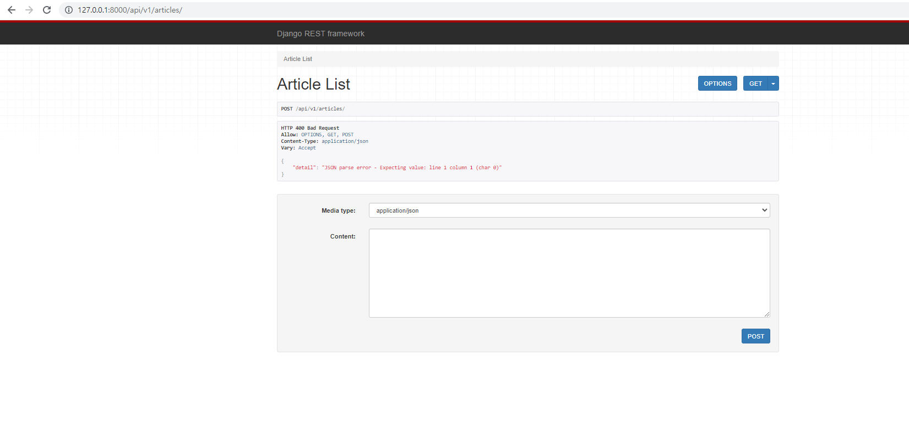
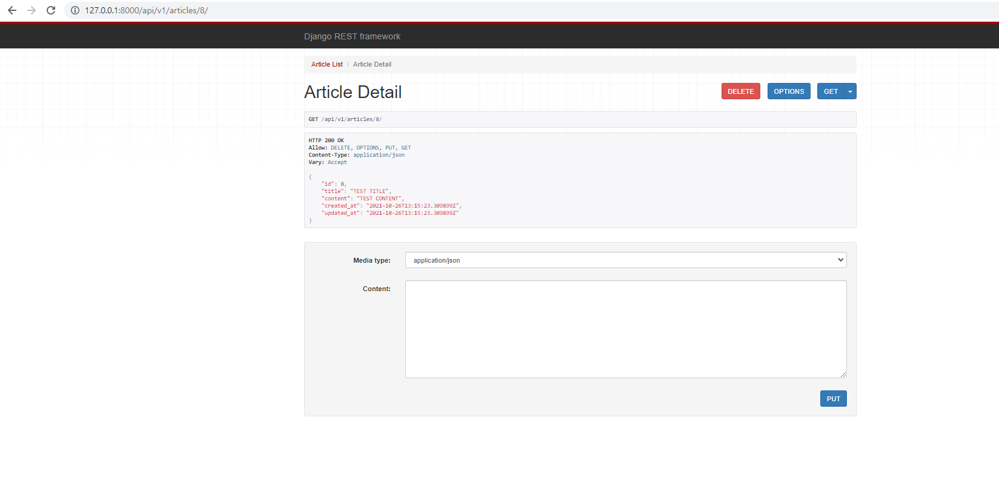
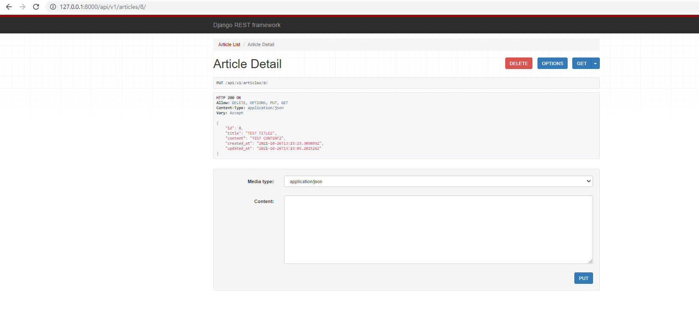
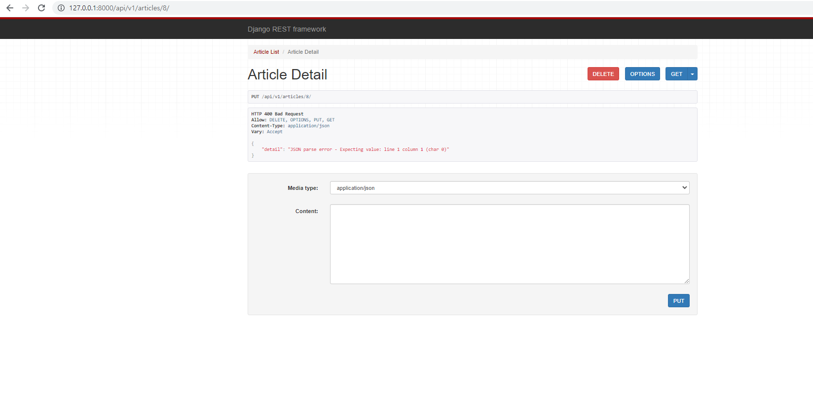
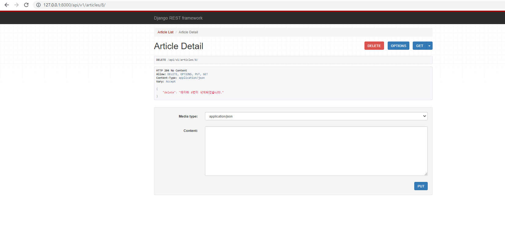

Django REST Framework

### - Background

```
* Web Framework
* Django
```

### - Goal

```
* DRF(Django REST Framework)에 대한 이해
```

### - Problem

❖ DRF를 활용하여 게시글 관련 REST API 서버를 구축하시오. 

❖ 프로젝트는 my_api, 앱은 articles으로 만들어 진행한다. 

❖ DRF 기본 템플릿을 활용하여 요청을 테스트한다.

1. Model

    • admin 페이지 혹은 djang-seed 라이브러리를 활용하여 5개의 데이터를 생성한다. 

2. serializers

   - ArticleListSerializer 

     • 모든 게시글 정보를 반환하기 위한 ModelSerializer 

     • id, title 필드 정의 

   - ArticleSerializer 

     • 게시글 상세 정보를 반환 및 생성하기 위한 ModelSerializer 

     • 모든 필드 정의

3. url & views

   - GET api/v1/articles/ 

     • 모든 게시글의 id와 title 컬럼을 JSON 데이터 타입으로 응답한다. 

   - POST api/v1/articles/ 

     • 검증에 성공하는 경우 새로운 게시글의 정보를 DB에 저장하고, 저장된 게시글의 정보를 응답한다. 

     • 검증에 실패하는 경우 400 Bad Request 예외를 발생시킨다. 

   - GET api/v1/articles/<article_pk>/ 

     • 특정 게시글의 모든 컬럼을 JSON 데이터 타입으로 응답한다.

   - PUT & DELETE api/v1/articles/<article_pk>/

     • PUT 요청인 경우 특정 게시글의 정보를 수정한다. 

     ​	• 검증에 성공하는 경우 수정된 게시글의 정보를 DB에 저장한다. 

     ​	• 검증에 실패할 경우 400 Bad Request 예외를 발생시킨다. 

     ​	• 수정이 완료되면 수정한 게시글의 정보를 응답한다. 

      • DELETE 요청인 경우 특정 게시글을 삭제한다. 

     ​	• 삭제가 완료되면 삭제한 게시글의 id를 응답한다. 

```python
# views.py
from rest_framework.response import Response
from rest_framework.decorators import api_view
from rest_framework import status

from django.shortcuts import render, get_list_or_404, get_object_or_404

from .models import Article
from .serializers import ArticleListSerializer, ArticleSerializer


@api_view(['GET', 'POST'])
def article_list(request):
    if request.method == 'GET':
        articles = get_list_or_404(Article)
        serializer = ArticleListSerializer(articles, many=True) 
        return Response(serializer.data)
    
    elif request.method == 'POST':
        serializer = ArticleSerializer(data=request.data)
        if serializer.is_valid(raise_exception=True):
            serializer.save()
            return Response(serializer.data, status=status.HTTP_201_CREATED)


@api_view(['GET', 'DELETE', 'PUT'])
def article_detail(request, article_pk):
    article = get_object_or_404(Article, pk=article_pk)
    
    if request.method == 'GET':
        serializer = ArticleSerializer(article)
        return Response(serializer.data)

    elif request.method == 'DELETE':
        article.delete()
        data = {
            'delete': f'데이터 {article_pk}번이 삭제되었습니다.'
        }
        return Response(data, status=status.HTTP_204_NO_CONTENT)

    elif request.method == 'PUT':
        # instance 값을 첫번째 인자로 넣어주면 수정 로직
        serializer = ArticleSerializer(article, data=request.data) 
        if serializer.is_valid(raise_exception=True):
            serializer.save()
            return Response(serializer.data)
```

```python
# serializers.py
from rest_framework import serializers
from .models import Article


class ArticleListSerializer(serializers.ModelSerializer):

    class Meta:
        model = Article
        fields = ('id', 'title',)


class ArticleSerializer(serializers.ModelSerializer):

    class Meta:
        model = Article
        fields = '__all__'
```


### Picture

- http://127.0.0.1:8000/api/v1/articles/

  - GET

  

  - POST(HTTP 201 Created)

  

  - POST(HTTP 400 Bad Request)

  

- http://127.0.0.1:8000/api/v1/articles/<article_pk>/

  - GET

  

  - PUT(HTTP 200 OK)

    

  - PUT(HTTP 400 Bad Request)

    

  - DELETE

    

