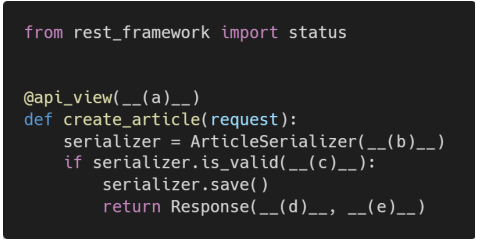

# Django REST Framework

### 1. 아래의 설명을 읽고 T/F 여부를 작성 후 이유를 설명하시오. 

- JSON 포맷의 데이터로 응답하기 위해서는 반드시 DRF를 사용해야 한다.
- DRF가 제공하는 기본 Form을 통해서만 여러 HTTP Method를 테스트 해볼 수 있다. 
-  api_view 데코데이터를 사용하지 않아도 HTTP Method에 대한 요청에 응답할 수 있다. 
- Serializers는 Queryset 객체를 JSON 포맷으로 변환 할 수 있는 python 데이터 타입으로 만들어준다. 

```
(1) : F (반드시 DRF를 사용하지 않아도 된다.)
(2) : F (DRF가 아니여도 테스트 해볼 수 있다.)
(3) : F (api_view 데코데이터는 필수이다.)
(4) : T
```


### 2. REST API 디자인 가이드 

REST API 디자인 설계 시 가장 중요한 항목을 2가지로 요약한다면, “정보의 자원을 표현해야 하는 __(a)__와 자원의 대한 행위를 표현하는__(b)__”라고 할 수 있다.” 빈칸 a, b에 들어갈 알맞은 답을 작성하시오. 

```
(a) : URI
(b) : HTTP Method
```


### 3. 아래에서 빈칸 a, b, c, d, e 에 들어갈 코드를 작성하시오. 

해당 view 함수는 유효성 검사를 통과 했을 경우 serializer 데이터와 http status code 201를 반환하며, 유효성 검사를 통과하지 못했을 경우 http status code 400을 반환한다.



```
(a) : ['POST']
(b) : data=request.data
(c) : raise_exception=True
(d) : serializer.data
(e) : status=status.HTTP_201_CREATED
```

