# Django REST Framework

### - Background

```
* Web Framework
* Django
```

### - Goal

```
* DRF(Django REST Framework)에 대한 이해
```

### - Problem

❖ DRF를 활용하여 음악 정보 관련 REST API 서버를 구축하시오. 

❖ 프로젝트는 my_api, 앱은 music으로 만들어 진행한다. 

❖ Postman을 활용하여 각 HTTP Method에 맞는 요청을 테스트하시오.

1. Model & Admin 

   • 작성 할 모델 및 필드 정보 

   • admin 페이지를 활용하여 가수, 해당 가수가 부른 노래를 2개씩 작성한다.

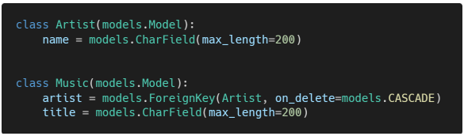

2. Serializer 

   - ArtistListSerializer 

     • 모든 가수의 정보를 반환하기 위한 Serializer 

     • id, name 필드 출력 

   - ArtistSerializer 

     • 상세 가수의 정보를 생성 및 반환하기 위한 Serializer 

     • id, name, music_set, music_count 필드 출력 (music_count 필드는 music_set을 count한 결과이다.) 

   - MusicListSerializer 

     • 모든 음악의 정보를 반환하기 위한 Serializer 

     • id, title 필드 출력 

   - MusicSerializer 

     • 상세 음악의 정보를 생성 및 반환하기 위한 Serializer 

     • id, title, artist 필드 출력

3. url & view 

   GET & POST api/v1/artists/ 

   ​	•GET 요청인 경우 모든 가수의 id와 name 컬럼을 JSON으로 응답한다. 

   ​	•POST 요청인 경우 가수의 정보를 생성한다. 

   ​		▪ 검증에 성공하는 경우 가수의 정보를 DB에 저장하고 생성된 가수의 정보와 201 Created를 응답한다. 

   ​		▪ 검증에 실패하는 경우 400 Bad Request를 응답한다. 

   GET api/v1/artists/<music_pk>/ 

   ​	•특정 가수의 모든 컬럼을 JSON으로 응답한다. 

   ​	•특정 가수의 노래 정보와 노래의 개수 정보를 함께 응답한다. 

   POST api/v1/artists/<music_pk>/music/ 

   ​	•특정 가수의 음악의 정보를 생성한다. 

   ​	•검증에 성공하는 경우 음악의 정보를 DB에 저장하고 생성된 음악의 정보와 201 Created를 응답한다. 

   ​	•검증에 실패하는 경우 400 Bad Request를 응답한다. 

   GET api/v1/music/ 

   ​	•모든 음악의 id와 title 컬럼을 JSON으로 응답한다. 

   GET & PUT & DELETE api/v1/music/<music_pk>/ 

   ​	•GET 요청인 경우 특정 음악의 모든 컬럼을 JSON으로 응답한다. 

   ​	•PUT 요청인 경우 특정 음악의 정보를 수정한다. 

   ​		▪ 검증에 성공하는 경우 수정된 음악의 정보를 DB에 저장한다. 

   ​		▪ 검증에 실패하는 경우 400 Bad Request를 응답한다.

   ​		▪ 수정이 완료된 이후에 수정된 음악의 정보를 응답한다.

   ​	 •DELETE 요청일 경우 특정 음악의 정보를 삭제한다. 

   ​		▪ 삭제가 완료된 이후에 삭제한 음악의 id와 204 No Content를 응답한다.

```python
# views.py
from django.shortcuts import get_list_or_404, get_object_or_404, render

from rest_framework.response import Response
from rest_framework.decorators import api_view
from rest_framework import status

from .models import Artist, Music
from .serializers import ArtistListSerializer, ArtistSerializer, MusicListSerializer, MusicSerializer
from music import serializers

@api_view(['GET', 'POST'])
def artist_list_create(request):
    # 데이터 조회
    if request.method == 'GET':
        # 1. 모든 아티스트의 정보를 가져온다.
        # artists = Artist.objects.all() # QuerySet 반환 (유사 리스트)
        artists = get_list_or_404(Artist) # QuerySet 반환 (유사 리스트)
        # 2. 가져온 데이터를 변환한다.
        serializer = ArtistListSerializer(artists, many=True) # id와 name 을 변환 
        # 3. 응답한다.
        return Response(serializer.data)
    
    # 데이터 생성
    elif request.method == 'POST':
        # 폼으로 저장할때 (참고)
        # form = ArticleForm(request.POST)
        # if form.is_valid():
        #     form.save()
        #     return redirect(index)

        serializer = ArtistSerializer(data=request.data)
        # raise_exception True 설정은 유효성 검사를 통과하지 못할 때
        # 기존 HTML이 리턴되는 것을 에러와 함께 JSON 형태로 응답해주는 옵션.
        if serializer.is_valid(raise_exception=True):
            serializer.save()
            return Response(serializer.data, status=status.HTTP_201_CREATED)
        
        # raise_exception=True 와 똑같은 역할
        # return Response(serializer.errors, status=status.HTTP_400_BAD_REQUEST)


@api_view(['GET'])
def artist_detail(request, artist_pk):
    # 1. 데이터를 가져온다.
    artist = get_object_or_404(Artist, pk=artist_pk)
    # 2. 데이터를 변환한다. (id, name, music_set, music_count)
    serializer = ArtistSerializer(artist)
    # 3. 변환된 데이터를 응답한다.
    return Response(serializer.data)


@api_view(['GET'])
def music_list(request):
    music_list = get_list_or_404(Music)
    serializer = MusicListSerializer(music_list, many=True)
    return Response(serializer.data)


@api_view(['GET', 'PUT', 'DELETE'])
def music_detail_update_delete(request, music_pk):
    # 음악 데이터 가져오기
    music = get_object_or_404(Music, pk=music_pk) 
    # 데이터 조회
    if request.method == 'GET':
        serialzer = MusicSerializer(music)
        return Response(serialzer.data)
    # 데이터 수정
    elif request.method == 'PUT':
        # 기존 form을 사용할 때 instance 값을 넣어주었다!!
        # serializer 도 instance 값을 넣어줘서 수정하면 됨
        serializer = MusicSerializer(music, data=request.data)
        if serializer.is_valid(raise_exception=True):
            serializer.save()
            return Response(serializer.data)

    # 데이터 삭제
    elif request.method == 'DELETE':
        music.delete()
        data = {
            'msg': f'{music_pk}번 음악이 삭제되었습니다.'
        }
        return Response(data, status=status.HTTP_204_NO_CONTENT)


# 음악 정보 저장 with artist
@api_view(['POST'])
def music_create(request, artist_pk):
    artist = get_object_or_404(Artist, pk=artist_pk)

    serializer = MusicSerializer(data=request.data)
    if serializer.is_valid(raise_exception=True):
        # 유효성 검사는 read_only 설정으로 통과하지만!!
        # DB에서 NOT NULL 에러가 발생할 수 있음! 필요한 정보를 추가해줘야함
        # 폼에서는 다음과 같이 해결
        # comment = form.save(commit=False)
        # comment.article = aritlce
        # comment.save()

        # serializer 는 좀 더 쉽게 해결 가능!
        # save 할 때 .save(필요한 필드명 = 실제 넣을 데이터)
        serializer.save(artist=artist)
        return Response(serializer.data, status=status.HTTP_201_CREATED)
```

```python
# serializers.py
from rest_framework import serializers
from .models import Artist, Music


# Serializer 작성은 Form 작성하는 방법과 굉장히 유사함!!
class ArtistListSerializer(serializers.ModelSerializer):
    class Meta:
        model = Artist
        fields = ['id', 'name']

# ArtistSerializer 에서 Nested로 사용하기 때문에 위쪽으로 위치 이동!!
class MusicListSerializer(serializers.ModelSerializer):
    class Meta:
        model = Music
        fields = ['id', 'title']


class ArtistSerializer(serializers.ModelSerializer):
    # 역참조 데이터를 확인하기 위한 필드 (pk 정보를 리스트화해서 보여주는 방식)
    # 이때 필드명은 역참조 명과 동일해야 합니다!!!
    # 만약에 models.py 에서 역참조명을 related_name 속성을 통해 변경하면 필드명도 똑같이 변경
    # 'Artist' object has no attribute 'music_set'
    # music_set = serializers.PrimaryKeyRelatedField(many=True, read_only=True)

    # 역참조 데이터를 확인하기 위한 필드 (데이터를 리스트화해서 보여주는 방식)
    # Nested Relationship
    music_set = MusicListSerializer(many=True, read_only=True)

    # source 는 해당 필드에 들어갈 값을 정의
    # 현재 변환되는 data의 이름이 앞에 생략되어 있음.
    # 역참조를 통해서 아티스트의 전체 음악 개수를 저장하는 필드
    music_count = serializers.IntegerField(source='music_set.count', read_only=True)
    
    class Meta:
        model = Artist
        fields = '__all__'
        # read_only_fields = ['music_set',] 
        # 우리가 정의하는 필드는 여기에서 사용 못함. 
        # AssertionError: Relational field must provide a `queryset` argument, override `get_queryset`, or set read_only=`True`.


class MusicSerializer(serializers.ModelSerializer):
    artist = ArtistListSerializer(read_only=True)
    class Meta:
        model = Music
        fields = '__all__'
```

### Picture

-  api/v1/artists/

  - GET

  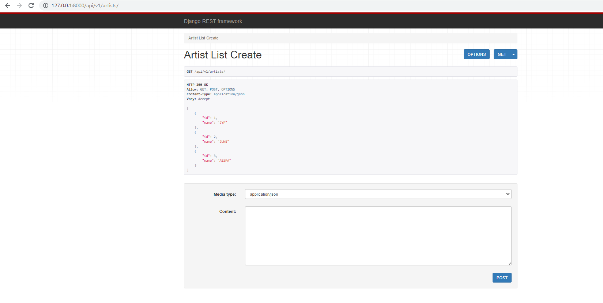

  - POST(HTTP 201 Created)

  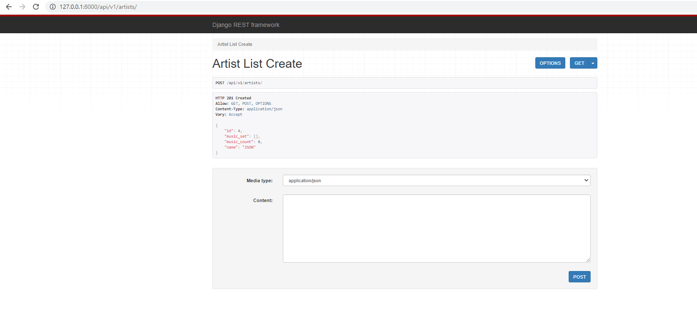

  - POST(HTTP 400 Bad Request)

  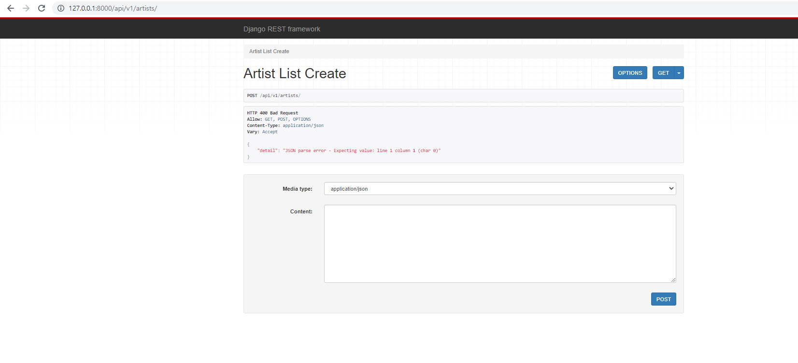

- api/v1/artists/<artist_pk>/

  - GET

  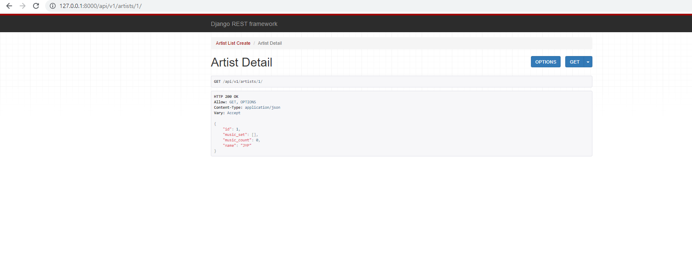

- api/v1/artists/<artist_pk>/music/

  - POST(HTTP 201 Created)

  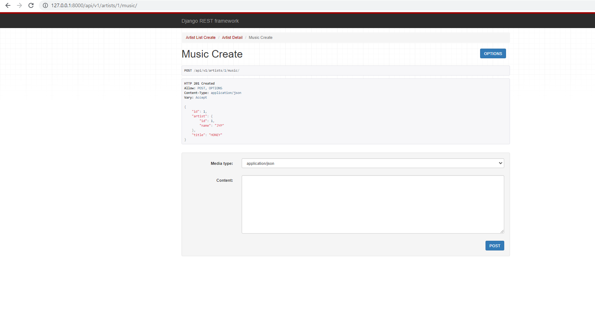

  - POST(HTTP 400 Bad Request)

  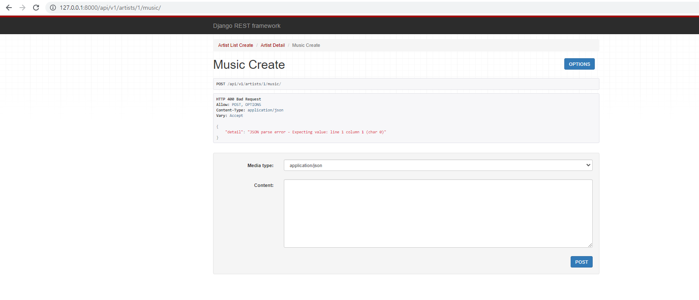

-  api/v1/music/

  - GET

  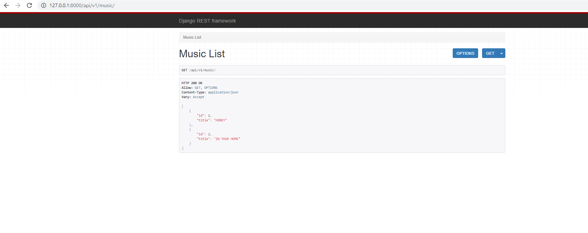

- api/v1/music/<music_pk>/

  - GET

  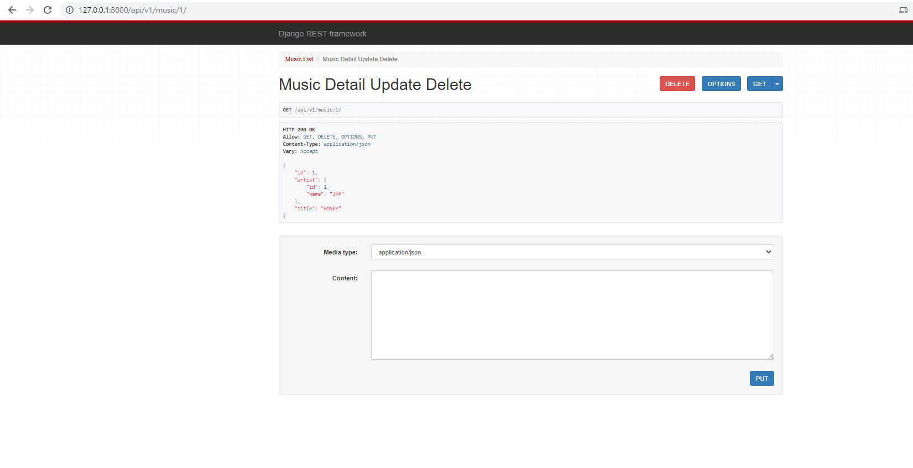

  - PUT(HTTP 200 OK)

  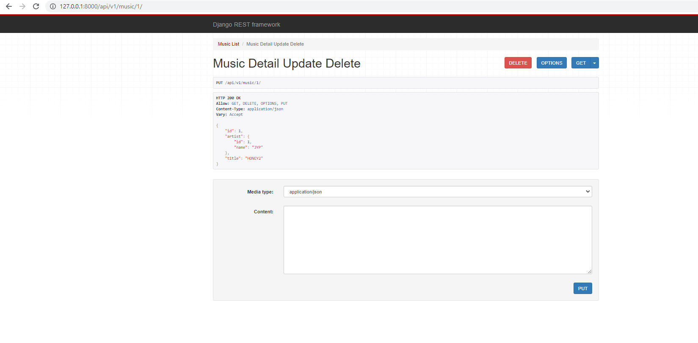

  - PUT(HTTP 400 Bad Request)

  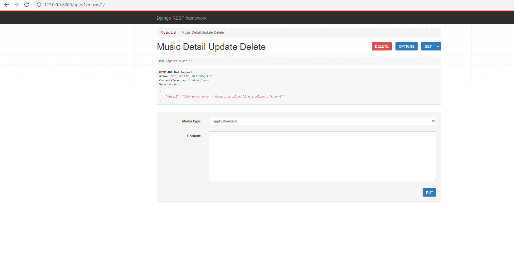

  - DELETE

  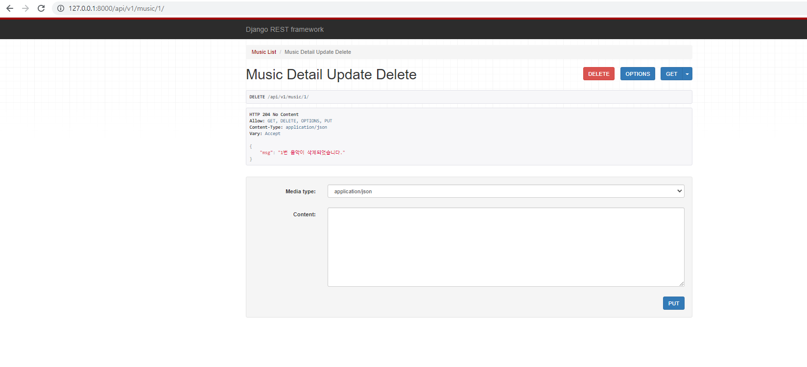
