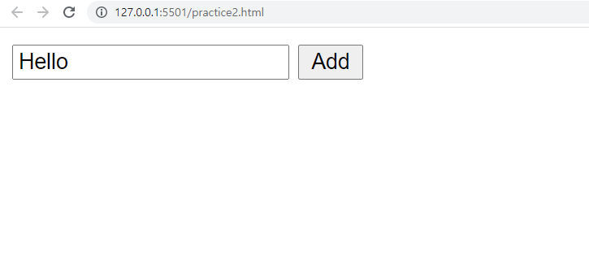

# JavaScript 기초

### - Background

```
* JavaScript
```

### - Goal

```
* DOM 조작에 대한 이해
```

### - Problem

❖  제시된 CREATE, READ 기능을 충족하는 todo app을 완성하시오.

​	[필수사항]

	 - form 태그를 사용한다.
  - form에서 submit 이벤트가 발생되었을 때 input에 작성된 값이 todo로 추가된다. 
  - todo는 ul 태그의 li 태그로 추가된다. 
  - todo가 추가된 후 input value의 값은 초기화 된다. 
  - (선택) 빈 값인 데이터는 입력을 방지한다. 
      - 빈 값이면 알림창을 띄워 값을 입력하도록 안내한다.

```html
<!-- practice2.html -->
<body>
  <form action="#">
    <input type="text">
    <button>Add</button>
  </form>
  <ul>
    
  </ul>

  <script>
    const form = document.querySelector('form')

    const addTodo = function (event) {
      event.preventDefault()

      console.log(event)

      const input = document.querySelector('input')
      const content = input.value
  
      if (content.trim()) {
        const liTag = document.createElement('li')
        liTag.innerText = content

        const ulTag = document.querySelector('ul')
        ulTag.appendChild(liTag)
      } else {
        alert('값을 입력해주세요!')
      }
      
      event.target.reset()
    }

    form.addEventListener('submit', addTodo)
  </script>
</body>
```

### Picture


