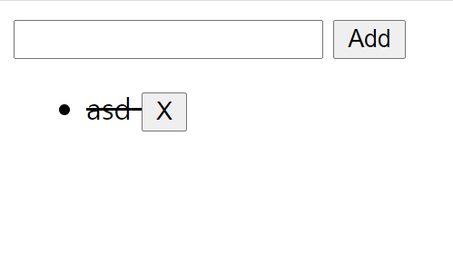

# JavaScript 기초

### - Background

```
* JavaScript
```

### - Goal

```
* DOM 조작에 대한 이해
```

### - Problem

❖  템플릿 코드를 통해 제시된 기능을 충족하는 todo app을 완성하시오.

​	[필수사항]

	- TODO 아이템을 추가할 수 있다.
	- 아이템 클릭을 통해 아이템에 취소선을 추가하거나 제거할수 있다.
	- x 버튼을 통해 아이템을 삭제할 수 있다.
​	[선택사항]

```
- 빈 값의 데이터 입력 방지
- 빈 값 입력 시 브라우저 팝업 출력하기
- 데이터 작성 후 input value 초기화
```

```js
<form action="#">
    <input type="text">
    <button>Add</button>
  </form>
  </form>
  <ul>
    
  </ul>

  <script>
    const form = document.querySelector('form')

    const addTodo = function (event) {
      event.preventDefault()

      const input = document.querySelector('input')
      const content = input.value
      

      if (content.trim()) {
        const liTag = document.createElement('li')
        const buttonTag = document.createElement('button')
        const btnText = document.createTextNode( 'X' )
        const blinkText = document.createTextNode(" ")
        liTag.innerText = content;
        liTag.style.textDecoration = 'line-through'
        const ulTag = document.querySelector('ul')
        
        buttonTag.append(btnText)
        liTag.appendChild(blinkText)
        
        liTag.appendChild(buttonTag)

        console.log(liTag.button)
        ulTag.appendChild(liTag)
      } else {
        alert('할 일을 입력해주세요!')
      }
      
      event.target.reset()
    }
    form.addEventListener('submit', addTodo)
  </script>

// 버튼과 줄 생성까지 완성했습니다.
```

### Picture


