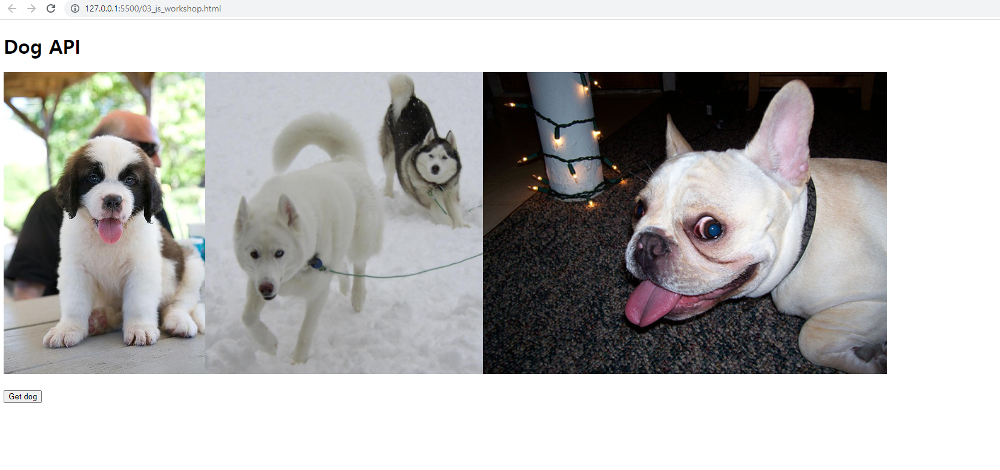

# JavaScript 심화

### - Background

```
* JavaScript
```

### - Goal

```
* AJAX 요청에 대한 이해
```

### - Problem

❖ 공유된 HTML코드의 주석과 마크업을 참고하여, 버튼을 클릭하면 axios를 통해 API 요청을 보내고 받아 온 이미지 데이터를 페이지에 렌더링 하는 앱을 완성하시오.

 • API : https://dog.ceo/

```js
<body>
  <h1>Dog API</h1>
  <!--  -->
  <div class="dog-img"></div>
  <br>
  <button>Get dog</button>
  
  <!-- axios CDN을 삽입한다. -->
  <script src="https://cdn.jsdelivr.net/npm/axios/dist/axios.min.js"></script>
  <script>
    const API_URI = 'https://dog.ceo/api/breeds/image/random'
    
    function getDog () {
      // axios를 사용하여 API_URI로 GET 요청을 보낸다.
      axios.get(API_URI)
      // .then 메서드를 통해 요청이 성공적인 경우의 콜백함수를 정의한다.
        .then(response => {
          return response.data
        })
      // 응답객체의 데이터에서 이미지에 대한 리소스를 img 요소의 src 속성으로 할당한다.
        .then(response => {
            const imgUrl = response.message
            const newImgTag = document.createElement('img')
            newImgTag.src = imgUrl
            const dogBox = document.querySelector('.dog-img')
            console.log(dogBox)
            dogBox.appendChild(newImgTag)
          })
        .catch(error => {
          console.log(error)
        })
    }

    const button = document.querySelector('button')
    button.addEventListener('click', getDog)
  </script>
</body>
```

### Picture


