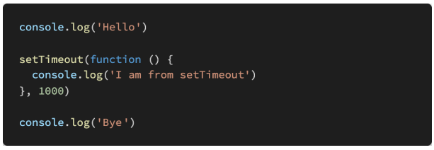

# JavaScript 심화

### 1. 아래의 설명을 읽고 T/F 여부를 작성하시오.

- Event Loop는 Call Stack이 비워지면 Task Queue의 함수를 Call Stack으로 할당하는 역할을 한다. 
- XMLHttpRequest(XHR)는 AJAX 요청 instance를 생성하는 JavaScript API이다. XHR의 메서드로 브라우저와 서버 간의 네트워크 요청을 전송할 수 있다. 
- axios는 XHR(XMLHttpRequest)을 보내고 응답 결과를 Promise 객체로 반환해주는 라이브러리이다.

```
(1) : T
(2) : T
(3) : T
```

### 2. 아래의 코드가 실행되었을 때 Web API, Task Queue, Call Stack 그리고 Event Loop에서 어떤 동작이 일어나는지 서술하시오.



```
(1) console.log('Hello!')이 먼저 Call Stack에 들어간다.
(2) Hello!가 출력되며 console.log('Hello')가 Call Stack에서 사라진다.
(3) setTimeout함수가 Call Stack으로 갔다가 Web API로 들어간다. (지정된 시간만큼 들어가있음, 1000 = 1초)
(4) setTimeout함수가 Web API에 들어가있는 동안 console.log('Bye!')가 Call Stack에 들어간다.
(5) Bye가 출력되며 console.log('Bye')가 Call Stack에서 사라진다.
(6) setTimeout함수가 지정된 시간이 지나면 Task Queue에서 대기를 한다.
(7) Event Loop가 Call Stack을 확인하여, 비어있을 경우 Task Queue에 있는 동작을 Call Stack으로 가져온다.(FIFO)
(8) Call Stack이 비어있기 때문에, Task Queue에 있는 setTimeout에 있는 함수를 Call Stack으로 가져온다.(console.log('I am from setTimeout'))
(9) I am from setTimeout을 출력한 후, console.log('I am from setTimeout')이 Call Stack에서 사라진다.
```


### 3. JS는 Event loop를 기반으로 하는 Concurrency model을 가지고 있다고 한다. Concurrency 키워드의 특징을 작성하고, 이와 비슷한 키워드로 비교되는 Parallelism의 개념과 두 개념의 차이점을 서술하시오.

```
Concurrency (동시성) : 동시에 실행되는 것 같이 보이는 것, 한번에 많은 것을 처리
Parallelism (병렬성) : 실제로 동시에 여러 작업이 처리되는 것, 한번에 많은 일을 처리
```

