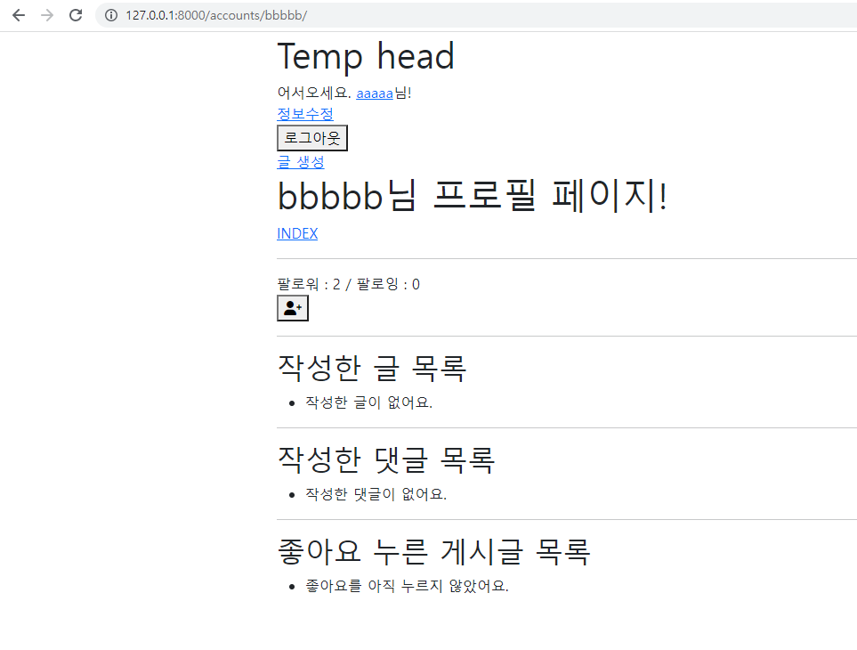
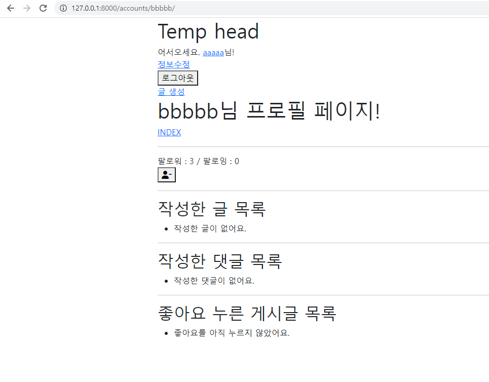

# JavaScript 심화

### - Background

```
* JavaScript
```

### - Goal

```
* AJAX 요청에 대한 이해
```

### - Problem

❖ Django 수업자료에서 좋아요/팔로우 기능이 완성된 프로젝트를 사용해 팔로우 기능을 axios 라이브러리를 활용하여, AJAX 요청으로 처리될 수 있도록 구현하시오.

 • 로그인 사용자의 “팔로우” 여부에 따라 아이콘이 변경되어야 한다.

 • 변경된 총 “팔로우”를 누른 사용자의 수가 반영되어야 한다. 

• 위의 모든 요구 사항은 페이지 새로고침 없이 진행되어야 한다.

```html
 profile.html 



<h1>{{ person.username }}님 프로필 페이지!</h1>

<a href="">INDEX</a>
<hr>
팔로워 : <span id="txt-followers">{{ person.followers.all|length }}</span> / 팔로잉 : <span id="txt-followings">{{ person.followings.all|length }}</span>

  <form id="follow-form" data-pk="{{ person.pk }}">
  
  
    <button id="btn-follow">
    <i class="fas fa-user-plus"></i>
    </button>
     <button id="btn-follow" style="">팔로우 취소</button> 
  
    <button id="btn-follow">
    <i class="fas fa-user-minus"></i>
    </button>
     <button id="btn-follow" style="">팔로우</button> 
  
  </form>


<hr>
<h2>작성한 글 목록</h2>
<ul>
  
  <li>
    <a href="">{{ article.title }}</a>
  </li>
  
  <li>작성한 글이 없어요.</li>
  
</ul>
<hr>
<h2>작성한 댓글 목록</h2>
<ul>
  
    <li>{{ comment.content }}</li>
  
    <li>작성한 댓글이 없어요.</li>
  
</ul>
<hr>
<h2>좋아요 누른 게시글 목록</h2>
<ul>
  
    <li>
      <a href="">{{ like_article.title }}</a>
    </li>
  
    <li>좋아요를 아직 누르지 않았어요.</li>
  
</ul>



  <script>
    const form = document.querySelector('#follow-form')
    form.addEventListener('submit', (event) => {
      event.preventDefault()
      const csrftoken = document.querySelector('[name=csrfmiddlewaretoken]').value
      // const pk = '{{ person.pk }}'
      const pk = form.dataset.pk
      axios({
        method:'post',
        //url: form.action,
        url:`/accounts/${pk}/follow/`,
        headers: {
          'X-CSRFToken':csrftoken
        }
      })
      .then(res => {
        //const btn = form.querySelector('#btn-follow')
        const btn = document.querySelector('#btn-follow')
        const icon = form.querySelector('i')
        const txtfollowers = document.querySelector('#txt-followers')
        const txtfollowings = document.querySelector('#txt-followings')
        if (res.data.is_follow){
          //btn.innerText = '팔로우 취소'
          //btn.style ='background-color: rgb(255, 0, 0);'
          icon.classList.remove('fa-user-plus')
          icon.classList.add('fa-user-minus')
        }
        else {
          //btn.innerText = '팔로우'          
          //btn.style ='background-color: aqua;'
          icon.classList.remove('fa-user-minus')
          icon.classList.add('fa-user-plus')
        }
        txtfollowers.innerText = res.data.cnt_followers
        txtfollowings.innerText = res.data.cnt_followings
      })  
      .catch(err => {
        console.log(err)
      })
    })
    
  </script>

```

```python
# views.py
@require_POST
def follow(request, user_pk):
    User = get_user_model()
    you = get_object_or_404(User, pk=user_pk)
    if request.user.is_authenticated:
        me = request.user
        if you != me:
            if you.followers.filter(pk=me.pk).exists():
                you.followers.remove(me)
                is_follow = False
            else:
                you.followers.add(me)
                is_follow = True
        data = {
            'is_follow': is_follow,
            'cnt_followers': you.followers.count(),            
            'cnt_followings': you.followings.count(),
        }
        return JsonResponse(data)
        # return redirect('accounts:profile', you.username)
    return redirect('accounts:login')
```


### Picture




