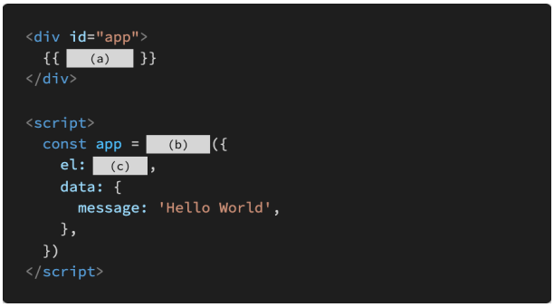

# Vue 기초

### 1. 아래의 설명을 읽고 T/F 여부를 작성하시오. 

- SPA는 Single Pattern Application의 약자이다.
- SPA는 웹 애플리케이션에 필요한 모든 정적 리소스를 한 번에 받고, 이후부터는 페이지 갱신에 필요한 데이터만 전달받는다.
- Vue.js에서 말하는 ‘반응형’은 데이터가 변경되면 이에 반응하여, 연결된 DOM이 업데이트되는 것을 의미한다. 

```
(1) F
(2) T
(3) T
```


### 2. MVVM은 무엇의 약자이고, 해당 패턴에서 각 파트의 역할은 무엇인지 간단히 서술하시오. 

```
Model View View Model
(1) Model : JavaScript의 Object 자료구조
(2) View : Data의 변화에 따라서 바뀌는 대상
(3) View Model : View와 Model 사이에서 Data와 DOM에 관련된 모든 일을 처리
```


### 3. 다음의 빈칸 (a), (b), (c)에 들어갈 코드를 작성하시오.



```
(a) : message
(b) : new Vue
(c) : #app
```


