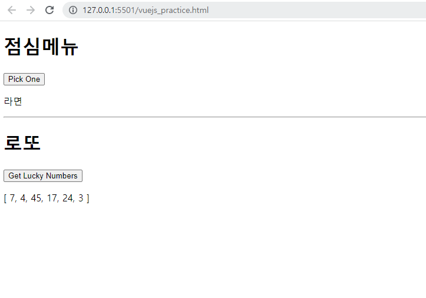

# Vue 기초

### - Background

```
* Vue
```

### - Goal

```
* Vue 기초 문법에 대한 이해
```

### - Problem

❖ Vue 및 lodash 라이브러리를 활용하여 점심메뉴와 로또 앱을 완성하시오. 

​	• Pick One 버튼을 클릭하면 미리 정의되어 있던 메뉴 리스트 중에서 랜덤한 아이템을 화면에 표시한다. 

​	• Get Lucky Numbers 버튼을 클릭하면 1부터 45까지의 숫자 중 랜덤한 숫자 6개를 선택하여 화면에 표시한다. 

```html
<body>
  <h1>점심메뉴</h1>
  <div id="app-1">
    <button v-on:click="getLunchMenu">Pick One</button>
    <p>{{ message }}</p>
  </div>
  <hr>
  <h1>로또</h1>
  <div id="app-2">
    <button v-on:click="getLuckyNumbers">Get Lucky Numbers</button>
    <p>{{ message }}</p>
  </div>
  <script src="https://cdn.jsdelivr.net/npm/vue/dist/vue.js"></script>
  <script src="https://cdn.jsdelivr.net/npm/lodash@4.17.21/lodash.min.js"></script>
  <script>
    var app1 = new Vue({
      el: '#app-1',
      data: {
        message: 'lunchMenu'
      },
      methods: {        
        getLunchMenu: function () {
          const lunchMenu = _.sample(['국밥', '수육', '라면', '떡볶이', '치킨', '피자', '짜장면', '짬뽕'])
          this.message = lunchMenu
        }
      }
    })
    var app2 = new Vue({
      el: '#app-2',
      data: {
        message: 'luckyNumbers'
      },
      methods: {        
        getLuckyNumbers: function () {
          const luckyNumbers = _.sampleSize([1, 2, 3, 4, 5, 6, 7, 8, 9, 10, 11, 12, 13, 14, 15, 16, 17, 18, 19, 20, 21, 22, 23, 24, 25, 26, 27, 28, 29, 30, 31, 32, 33, 34, 35, 36, 37, 38, 39, 40, 41, 42, 43, 44, 45], 6)
          this.message = luckyNumbers
        }
      }
    })
    </script>
</body>
```

### - Picture


