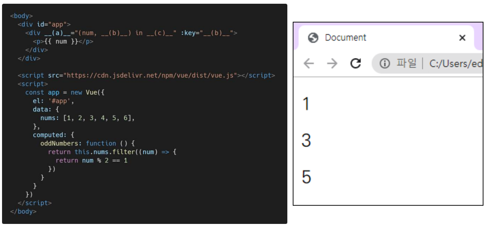

# Vue 기초

### 1. 아래의 설명을 읽고 T/F 여부를 작성하시오. 

​	• 동일한 요소에 v-for와 v-if 두 디렉티브가 함께 작성된 경우, 매 반복 시에 v-if의 조건문으로 요소의 렌더링 여부를 결정한다. 

​	• v-bind 디렉티브는 “@“, v-on 디렉티브는 “:” shortcut(약어)을 제공한다. 

​	• v-model 디렉티브는 input, textarea, select 같은 HTML 요소와 단방향 데이터 바인딩을 이루기 때문에 v-model 속성값의 제어를 통해 값을 바꿀 수 있다.

```
(1) T
(2) F
(3) F
```


### 2. computed와 watch의 개념과 그 차이에 대해서 간단히 서술하시오.

```
computed와 watch는 둘 다 특정 데이터가 변했을 때 동작한다.
다만 computed는 특정 데이터의 값을 바꾸고(선언형 프로그래밍 - return이 필수), watch는 감시하고 할 일을 명령한다(명령형 프로그래밍).
```


### 3. 다음은 홀수 데이터만 렌더링하는 Vue Application의 예시이다. 빈칸 (a), (b), (c)에 들어갈 코드를 작성하시오.



```
(a) : v-for
(b) : index
(c) : oddNumbers
```


