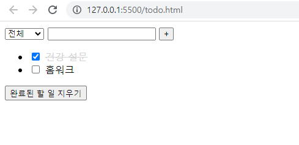
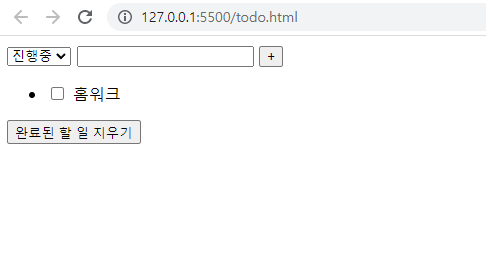
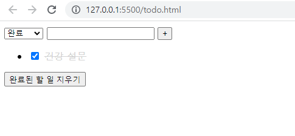

# Vue 기초

### - Background

```
* Vue
```

### - Goal

```
* Vue 기초 문법에 대한 이해
```

### - Problem

❖ Vue를 활용하여 todo list 앱을 완성하시오. 

​	• select 요소를 통해 todo list의 상태를 설정할 수 있다. 

​	• 상태 종류 – 전체, 진행중, 완료 • computed를 통해 상태별로 표시되는 todo list를 계산하고, 화면에 todo list를 표시한다. 

​	• Todo item의 체크박스를 통해 할 일의 완료 여부를 설정할 수 있다. 

​	• “완료된 할 일 지우기” 버튼을 누르면 모든 완료된 todo item을 삭제한다. • Local Storage를 활용하여 브라우저 종료 시에도 데이터가 사라지지 않는다.

```html
<!DOCTYPE html>
<html lang="en">
<head>
  <meta charset="UTF-8">
  <meta http-equiv="X-UA-Compatible" content="IE=edge">
  <meta name="viewport" content="width=device-width, initial-scale=1.0">
  <title>Document</title>
  <style>
    .completed{
      color: lightgray;
      text-decoration: line-through;
    }
  </style>
</head>
<body>
  <div id="app">
    <select v-model="status">
      <option value="all">전체</option>
      <option value="inProgress">진행중</option>
      <option value="completed">완료</option>
    </select>
    <input type="text" v-model="todo">
    <button @click="saveTodo">+</button>
    <ul>
      <li v-for="todo in todoListbyStatus" :key="todo.key">
        <input type="checkbox" v-model="todo.isCompleted">
        <span :class="{completed: todo.isCompleted}">{{ todo.content }}</span>
      </li>
    </ul>
    <button @click="delCompletedTodo">완료된 할 일 지우기</button>
  </div>

  <script src="https://cdn.jsdelivr.net/npm/axios/dist/axios.min.js"></script>
  <script src="https://cdn.jsdelivr.net/npm/vue/dist/vue.js"></script>
  <script>
    const STORAGE_KEY = 'TODO'
    // const todoStorage = []
    const todoStorage = {
      save: function (todoList) {
        localStorage.setItem(STORAGE_KEY, JSON.stringify(todoList))
      },
      read: function () {
        return JSON.parse(localStorage.getItem(STORAGE_KEY)) || []
      }
    }
    // window는 생략가능
    // 저장하는 방식
    // localStorage.setItem(STORAGE_KEY, todoStorage)
    // 읽어오는 방식
    // todoStorage = localStorage.getItem(STORAGE_KEY)
    const app = new Vue ({
      el: '#app',
      data: {
        // todoList: JSON.parse(localStorage.getItem(STORAGE_KEY)) || [],
        todoList: todoStorage.read(),
        todo: '',
        status: 'all',
      },
      methods: {
        saveTodo: function () {
          const result = {
            content: this.todo,
            isCompleted: false,
            key: Date.now()
            // key: (new Date()).getTime()
          }
          this.todoList.push(result)
          this.todo = ''
        },
        delCompletedTodo: function() {
          this.todoList =  this.todoList.filter(todo => {
            return !todo.isCompleted
          })
        }
      },
      computed:{
        todoListbyStatus: function () {
          const tempList = this.todoList.filter(todo => {
            if (this.status === 'inProgress') {
              return !todo.isCompleted
            } else if (this.status === 'completed'){
              return todo.isCompleted
            } else {
              return true
            }
          })
          return tempList
        }
      },
      watch: {
        todoList: {
          handler: function() {
            todoStorage.save(this.todoList)
          // localStorage.setItem(STORAGE_KEY, JSON.stringify(this.todoList))
          },
          deep: true
        }
      }
    })
  </script>
</body>
</html>
```

### - Picture







