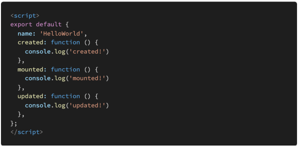

# Vue CLI

### 1. 아래의 설명을 읽고 T/F 여부를 작성하시오.

- Vue의 Life Cycle Hook에서 created Hook은 Vue template에 작성한 요소들이 DOM에 모두 그려지는 시점에 실행된다.
- npm은 Node Package Manager의 약자이며, npm을 통해 설치한 package 목록은 package.json 파일에 자동으로 작성된다.
- Vue CLI를 통해 만든 프로젝트는 브라우저가 아닌 node.js 환경이기 때문에 DOM 조작이나 Web API 호출 등 Vanilla JS에서의 기능을 사용할 수 없다. 

```
(1) : T
(2) : T
(3) : F
```


### 2. Vue Router에서 설정하는 history mode가 무엇을 뜻하는지 서술하시오. 

```
HTML History API를 사용해서 router를 구현한 것
브라우저의 히스토리는 남기지만 실제 페이지는 이동하지 않는 기능을 지원
```


### 3. Vue Life Cycle Hook을 참고하여, 다음 Vue application을 실행했을 때, console 창에 출력되는 메시지를 작성하시오.



```
created!
mounted!
```

