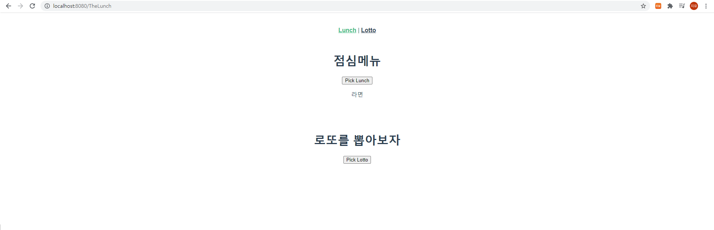
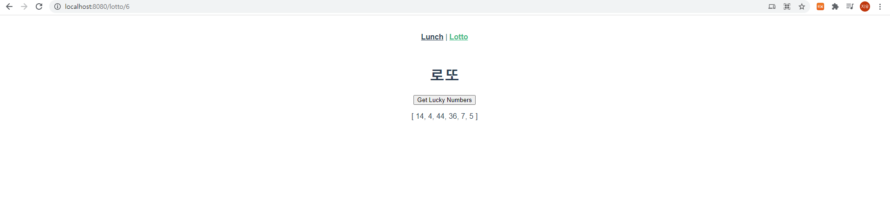

# Vue 기초

### - Background

```
* Vue
```

### - Goal

```
* Vue CLI 및 Vue Router에 대한 이해
```

### - Problem

❖  Vue CLI와 Vue Router를 활용하여 아래 조건을 만족하는 점심메뉴, 로또 앱을 완성하시오. 

 1. TheLunch.vue (“/lunch”) 

    - Pick Lunch 버튼을 클릭하면 랜덤으로 하나의 메뉴를 추천 

    - Pick Lotto 버튼을 클릭하면 “lotto/6” URL로 이동 

2. TheLotto.vue (“lotto/6”) 

   - Get Lucky Numbers 버튼을 클릭하면 랜덤으로 6개의 번호를 추천

```vue
<!-- TheLotto.vue -->
<template>
  <div>
    <h1>로또</h1>
    <!-- <h2>{{ $route.params.lottoNum }}개의 번호를 추첨합니다.</h2> -->
    <button @click="getLuckyNum">Get Lucky Numbers</button>
    <p>{{ selectedLuckyNum }}</p>
  </div>
</template>

<script>
import _ from 'lodash'


export default {
  name: 'TheLotto',
  data: function () {
    return {
      selectedLuckyNum: [],
    }
  },
  methods: {
    getLuckyNum: function () {
      const numbers = _.range(1, 46)
      this.selectedLuckyNum = _.sampleSize(numbers, this.$route.params.lottoNum)
    }
  }

}
</script>

<style>

</style>
```

```vue
<!-- TheLunch.vue -->
<template>
  <div>
    <h1>점심메뉴</h1>
    <button @click="getLunchMenu">Pick Lunch</button>
    <p>{{ selectedLunchMenu }}</p>
    <br>
    <br>
    <br>
      <h1>로또를 뽑아보자</h1>      
    <router-link :to="{ name: 'TheLotto', params: { lottoNum: 6 } }"><button>Pick Lotto</button></router-link>
  </div>
</template>

<script>
import _ from 'lodash'


export default {
  name: 'LunchMenu',
  data: function () {
    return {
      selectedLunchMenu: [],
    }
  },
  methods: {
    getLunchMenu: function () {
      const menus = ['국밥', '수육', '라면', '떡볶이', '치킨', '피자', '짜장면', '짬뽕']
      this.selectedLunchMenu = _.sample(menus)
    }
  }
}
</script>

<style>

</style>
```

### - Picture

​	TheLunch.vue



​	TheLotto.vue



